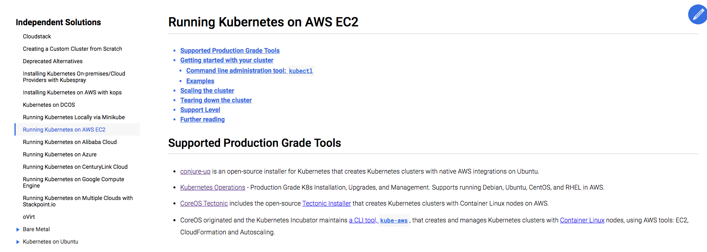
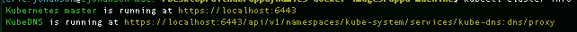
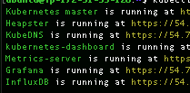

# Objective

This application takes previously configured docker-compose applications and makes them deployable to
a kubernetes cluster. If you are curious about any of the repositiories, either the original java application code
[itself](https://github.com/Appdynamics/AD-Capital) or the dockerized [version](https://github.com/Appdynamics/AD-Capital-Docker/), they are publicly available with detailed explanations as to what they contain. For the purpose of this walkthrough, it will be focused solely on
Kubernetes.

# Installing and Configuring Kubernetes

The first thing you need to do is make sure your environment is set up to use Kubernetes. If you would like to simply get it set up locally on your machine, there are a number of tutorials you can follow to get simple cluster spun up locally. If you are installing locally, I'd recommend either using Minkiube or docker for mac. I personally followed this [docker for mac tutorial](https://rominirani.com/tutorial-getting-started-with-kubernetes-with-docker-on-mac-7f58467203fd) which was great at getting Kubernetes spun up locally. Kubernetes also has a ton of tutorials on setting up [kubectl](https://kubernetes.io/docs/tasks/tools/install-kubectl/) (the kubernetes command line operator), and [minikube](https://kubernetes.io/docs/getting-started-guides/minikube/).

If you are looking to expand beyond a local distribution of Kubernetes (AWS, Azure, etc), there were a number of installation tutorials on the kubernetes website as well. For our distribution, we chose to use conjure to spin up a canonical distribution of kubernetes via aws ec2. Kops has been well demonstrated and we were looking for an Ubuntu specific installer.



If you choose to go the same route there is a good tutorial [here](https://tutorials.ubuntu.com/tutorial/install-kubernetes-with-conjure-up?_ga=2.135365305.964640007.1524584650-1699049142.1524584650#0)

If you are running it locally you should be able to type these two commands. First command validating that you installed the right version of kubectl and kubernetes. The second to validate where your cluster is.
```
kubectl version
kubectl cluster-info
```

and see your running Kubernetes Master and the other services should you choose them. The first photo is something similar you should see locally vs cloud provider.






You may access the UI directly via the Kubernetes master apiserver. Open a browser and navigate to https://<master-ip>:<apiserver-port>/api/v1/namespaces/kube-system/services/https:kubernetes-dashboard:/proxy/, where <kubernetes-master> is IP address or domain name of the Kubernetes master.

Typing

```
kubectl config view
```

will also give you the username and password context to accessing the Kubernetes UI dashboard.

Once you have installed your distribution, we can move onto the deployment of an [application](https://github.com/Appdynamics/AD-Capital-Kube/blob/master/KubernetesWalkthrough/2.md).
