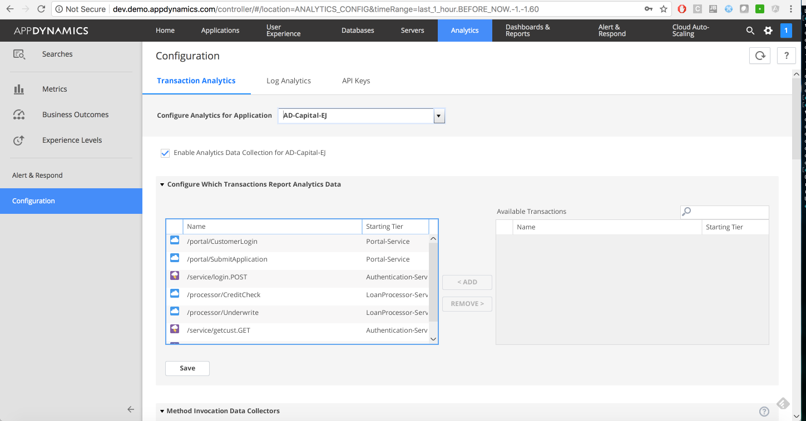
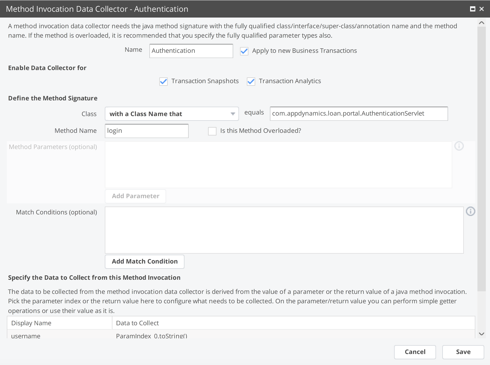
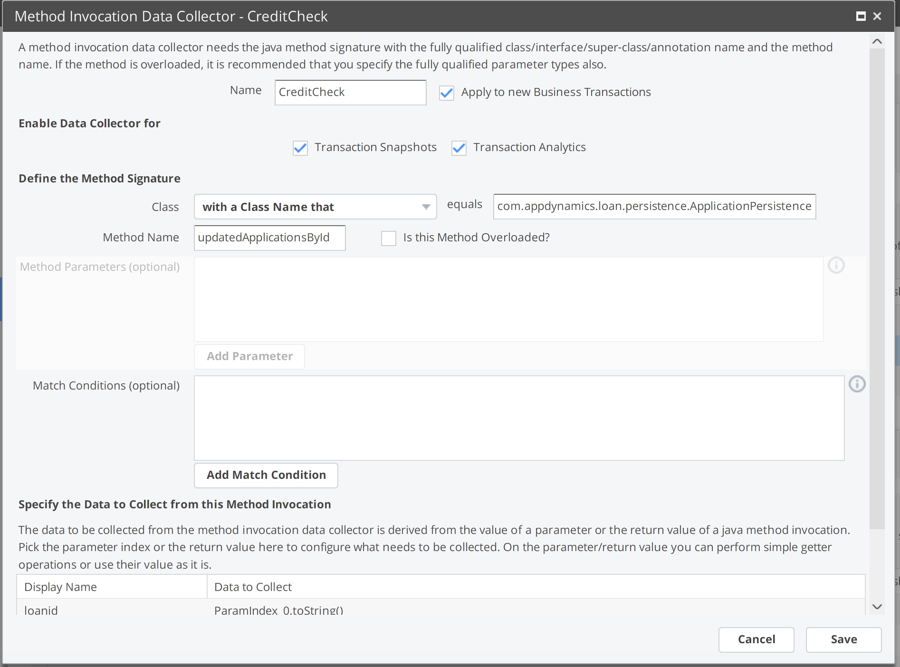
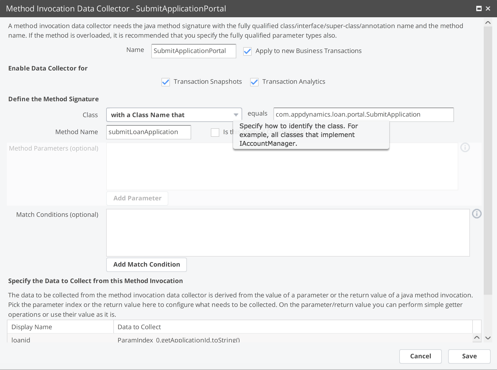
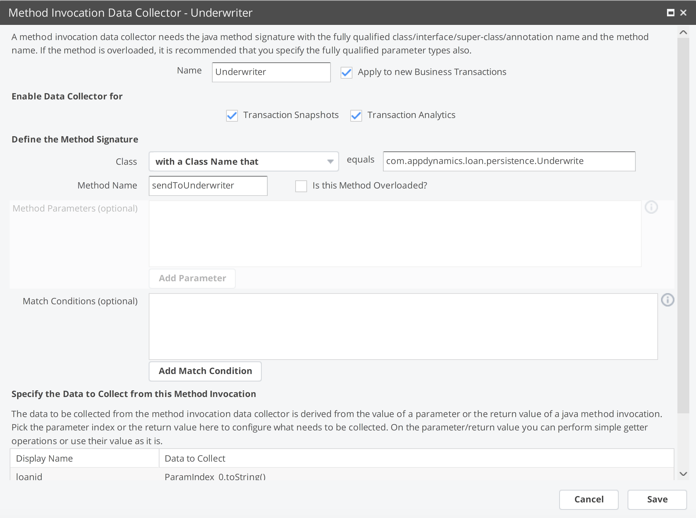
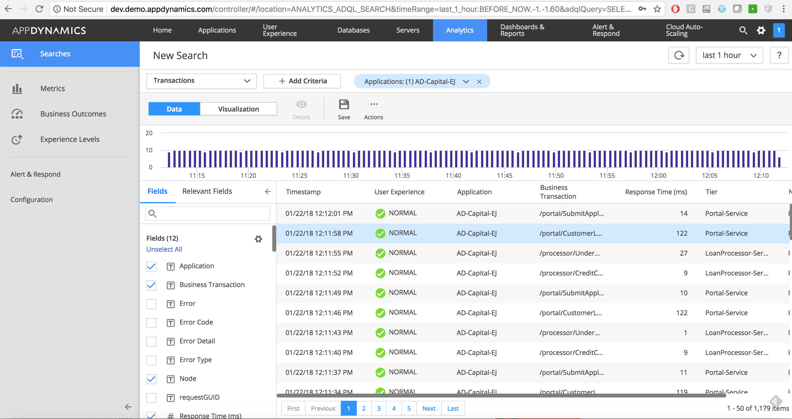

## Setting up Transaction Analytics
Once you've got the application up and running and reporting into the controller, it's
time to set up analytics. All of the logs are being written to a shared folder called "project". If you 'docker exec -it monitor bash; cd /project' you'll see all the logs for the application. Since we enabled all the logs to write to one location, it makes it easy to setup.

On the controller, navigate to analytics, and press configuration on the bottom left.

Select "Configure Analytics for Application" and choose your application
Select "Enable Analytics Data collection" for your app

Make sure all Business Transactions (BT's) are reporting analytics data

Then configure the individual method collectors like so

To verify transaction analytics are coming through, save your work, select searches, then add "Drag and Drop Search", and make one of the transaction criteria the application name. Select your application and you should see data like below

Once you've got transaction analytics set up it's time to set up [log analytics](https://github.com/Appdynamics/AD-Capital-Kube/blob/master/KubernetesWalkthrough/4.md) .
