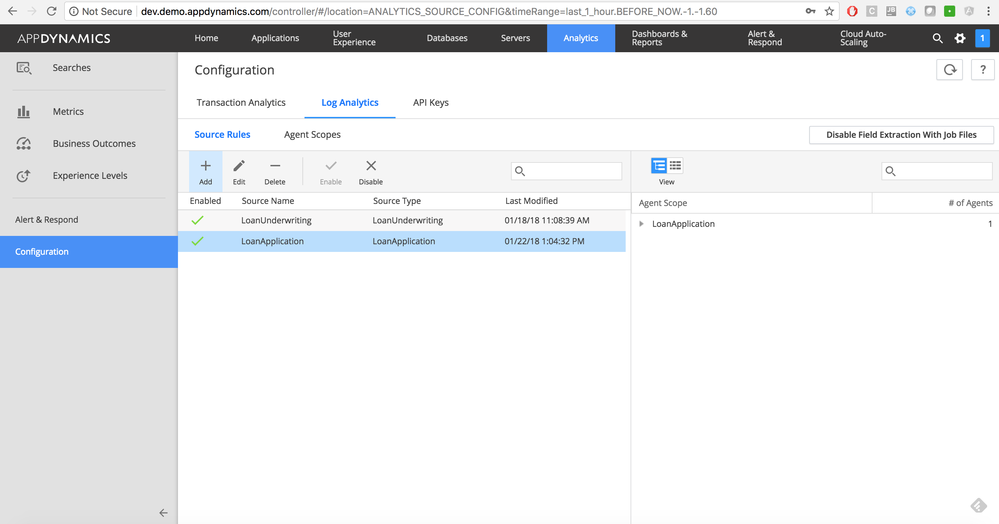
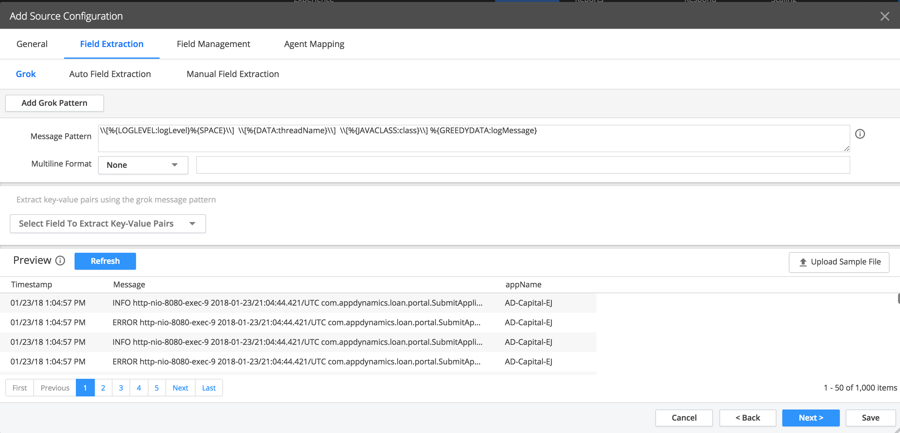
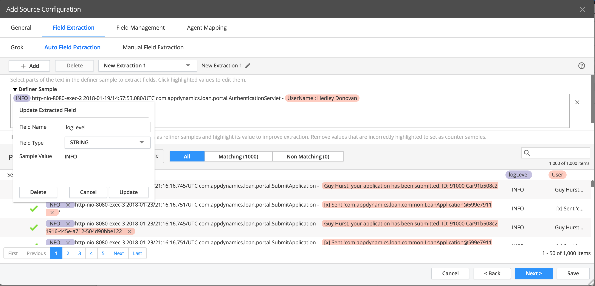
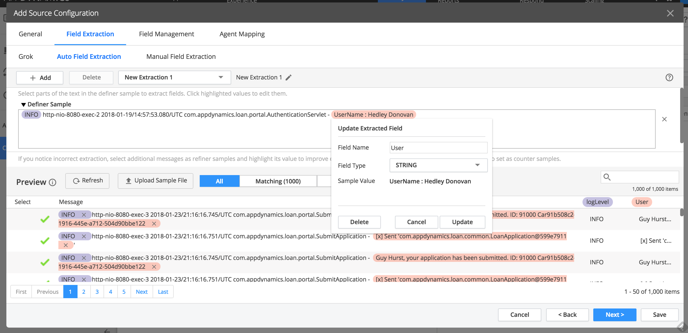
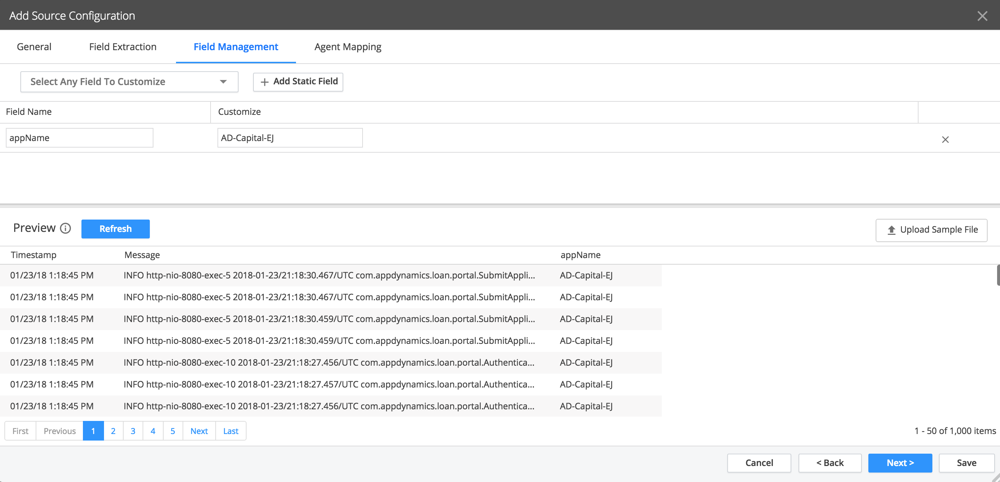
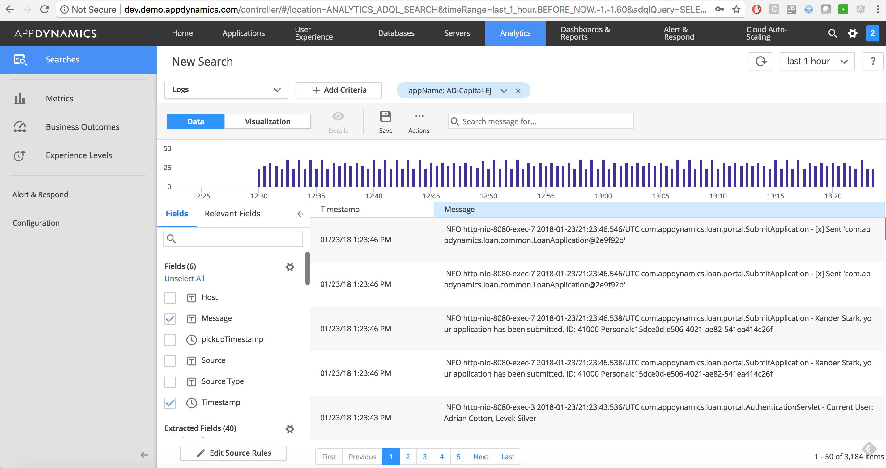

## Setting up Log Analytics

Similar to transaction analytics, it's just clicking configuration on the bottom left, then navigating to the log analytics tab. Follow the screenshots below to setup.

Click Add to set up a new extraction and fill in the fields. Naming the source and providing
the path to the logs folder. Since this project mounts the kube log files to the DaemonSet. You can grab those logs as well. They live at /var/log/ and so on.

Once you've done that click next or Field Extraction. To extract logs we use a grok pattern. You can also use a sample log file to preview how the extraction would happen. If you would like to do that, copy the loanapplication.log from a running docker container. To copy a log file to your local computer type

`docker cp monitor:/project/logs/loanapplication.log </path/on/your/local/computer>`

Then upload the sample file and you can see a preview of the log. Copy the formula to extract
key fields.

`\\[%{LOGLEVEL:logLevel}%{SPACE}\\]  \\[%{DATA:threadName}\\]  \\[%{JAVACLASS:class}\\] %{GREEDYDATA:logMessage}`

Once you have done that navigate to the auto field extraction. Here you can select
examples of log files to classify specific components as data points. Selecting a log as a definer sample allows the agent to intelligently collect data based on your specific rules and input. In this case we've chosen INFO as logLevel and then the username data as USER.

The last part here is making sure every log that comes through is associated with our application. If you navigate to field management and select add another static field, you can
add the appName as a static variable and then input your application name in the
field next to it.

Once you have done this, navigate back back to the analytics search component, and filter based on logs. Add the variable we just created in field management as a filter, and you should see your logs.

In summary, we've now taken a distributed application, put it into kubernetes, and enabled ourselves to monitor
our applications end to end gathering container level metrics. We've incorporated AppDynamics Application Agents to monitor the performance of your application. We've also incorporated Machine Agents to gather analytics data for the business, and log data for engineering support. Most importantly though, is that by isolating every container to serve one purpose and installing AppDynamics, we have almost 100% visibility into our software.
