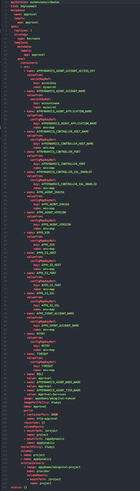

## Understanding Kubernetes and Project Context

Installing and deploying to Kubernetes was only a small component of actually porting a docker-compose application to kubernetes. There were a number of significant differences in the way applications are deployed via docker vs via kubernetes. You move from containers in docker, to containers in kubernetes, but split up even more. Once you are in kubernetes, the containers are then split up into deployments, pods, services, etc

This is going to be a breakdown of the individual yaml files and their purpose.

# The core "apps"

In our docker project, we had 5 key containers. Rest, approval, portal, processor, and verification. Each of these files share a similar application image, but deploy different war files dependent on their "ROLE", which is passed in at runtime. Each of our apps is associated with a deployment and service file. It's important to understand the role that deployments play in Kubernetes. You describe a desired state in a Deployment object, and the Deployment controller changes the actual state to the desired state at a controlled rate. You can define Deployments to create new ReplicaSets, or to remove existing Deployments and adopt all their resources with new Deployments.

Below is a detailed breakdown of a deployment file and what role each variable plays. Taking a look at this deployment file for an approval node we can do some dissection.

Going through this file. The first variables apiVersion and kind are self explanatory. They describe the api version of kubernetes and then the kind of kubernetes service you are
going to deploy. Below that is the meta data, with the name and labels. Labels are
extremely important for nodeSelector. Most relateable would be if you were choosing a DaemonSet to deploy your machine agent, you would select a label for the DaemonSet to identify which pods it was going to deploy to. Below that we have the 'spec', which is used to define container specific configurations.

The first variable there is the 'replicas', which indicates how may versions of the pod you want to create. Right below that, is the template specification for the pod. We see the variable spec, and then below that is containers, followed by a plethora of environment variables. These environment variables are being populated in two ways. The first is using a configMap (env-configmap.yaml), which you can see reference by name env-map, and the other is using a secret. You should notice that the value is being received not from the configmap but from our secretmap. Secrets are base64 encoded, and just a more secure way of handling access keys and credentials.

Once we move on from the environment variables, the next few are self explanatory. There is the image, which in this case is using a public registry, but if you were using ECR or a private registry that would be fine. There is then the image pull policy which tells the pod to pull the image every time. Below that is the name, the container port, and the container port name. Port naming was important for the istio service mesh, but Kubernetes does a very good job managing your port allocation. As long as your service exposes which port you need, Kubernetes handles the rest on it's end.

The last few things here are the volumes and init containers. The volumes her are "persistentvolumeclaims", which allow for storage to be dynamically allocated depending on when it's requested and what's available. In this case, the two volumes appdynamics and project are used to store agent binaries, infra config, and source code. Intro init containers. Init containers allowed for us to download all the dependencies to a volume before the pod that needs them is spun up. This alleviates all timing issues with a pod potentially not having the resources it needed when it started. This is most similar to the sidecar method which you could replace here.

# The core "services"

The most stable part of our deployment which was surprising was our services. Our database and rabbitmq had consistent behavior and it made deployment variables extremely easy. It's important to understand the role services play in Kubernetes. From their website, "A Kubernetes Service is an abstraction which defines a logical set of Pods and a policy by which to access them - sometimes called a micro-service. The set of Pods targeted by a Service is (usually) determined by a Label Selector (see below for why you might want a Service without a selector).

As an example, consider an image-processing backend which is running with 3 replicas. Those replicas are fungible - frontends do not care which backend they use. While the actual Pods that compose the backend set may change, the frontend clients should not need to be aware of that or keep track of the list of backends themselves. The Service abstraction enables this decoupling."

Note that a Service can map an incoming port to any targetPort. By default the targetPort will be set to the same value as the port field. Perhaps more interesting is that targetPort can be a string, referring to the name of a port in the backend Pods. The actual port number assigned to that name can be different in each backend Pod. This offers a lot of flexibility for deploying and evolving your Services. For example, you can change the port number that pods expose in the next version of your backend software, without breaking clients.

In our scenario here looking at any service, they are fairly straightforward. The service declaration is especially important if you have a set of pods that expose a specific port.

# The core "monitoring"

We knew that we were going to require a machine agent to run kubernetes visibility and analytics, but we hadn't figured out best practice. Originally the worry was pods communicating with eachother, but we realized the best solution to run this would be to use a DaemonSet. Running the MA as a daemonSet is not much different than running it as an individual pod. Running it as a daemonSet makes it much more managaebale, as it scales depending on the size of your deployment. The only unique configuration to this was setting the flags to enable kubernetes visibility and analytics. The analytics flag wont be necessary in 4.5 as it will become part of the app agent. Also important are the cluster roles which allow it to reach all the nodes in the cluster or the ones with the permissions you specify.

# The core "config"

AppDynamics agents require a number of flags and parameters to be set for the agent to deploy. We knew that some would be easy to pass via environment variables, but we wanted to reduce repetition as much as possible. We also knew that things like access keys and other variables should be somewhat protected. This culminated in using a config map to handle everything that didn't need to be protected, and adopting kubernetes secrets to handle everything else. The map is fairly self explanatory. It includes the data, which is the environment variables and the subsequent data. It is of type config map, and then you name it. In your deployment or service files these values are consumed. Secret values are base 64 encoded, which is why you had to type that echo pipe base64 command to get the value to replace.
