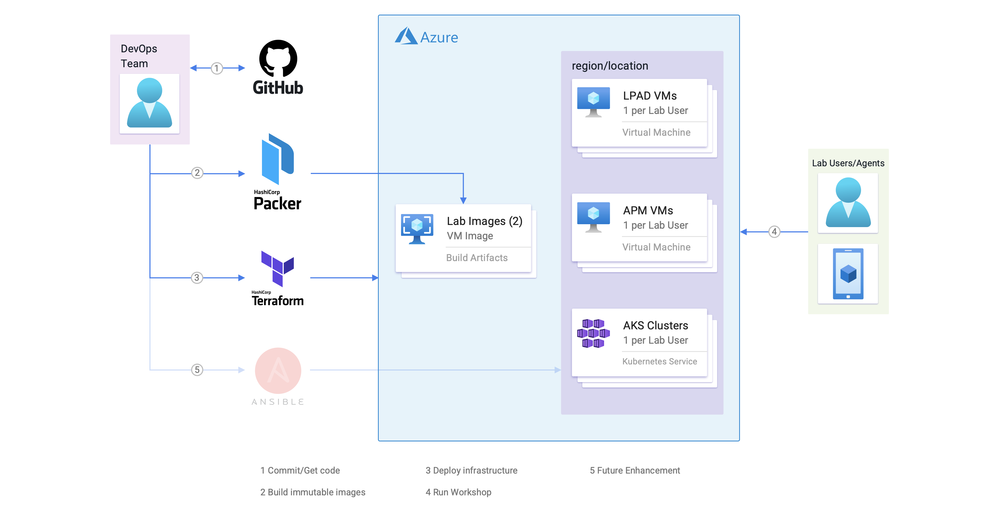
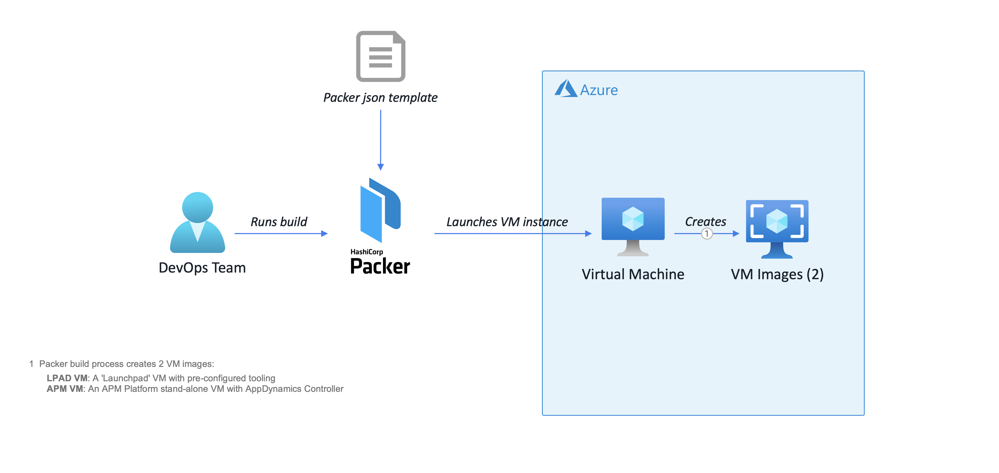
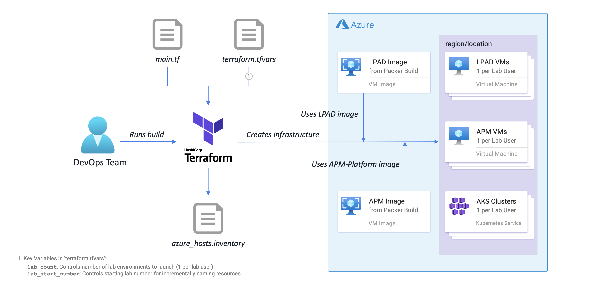

# Microsoft Azure VM Image Build and Deployment Instructions

## Overview

Here is an example of the deployment architecture when deployed to the Azure Cloud Platform:  

__AppD Cloud Kickstart: Workshop Deployment on Azure__


## Build and Deployment Steps

Before building and deploying the AppD Cloud Kickstart artifacts for Azure, you will need to install the 
Azure command-line interface (Azure CLI). The Azure CLI manages authentication, local configuration, 
developer workflow, and interactions with the Azure Cloud Platform APIs. It is the primary tool used to 
create and manage Azure Cloud resources.  

The Azure CLI will also allow you to cleanup and delete any resources created by the DevOps tooling when 
you are finished, such as purging old VM images created by Packer.

## Azure-Specific Installation Instructions - macOS

Here is a list of the additional recommended software to be installed on the host macOS machine:

-	Azure CLI 2.46.0

Perform the following steps to install the needed software:

1.	Install [Azure CLI 2.46.0](https://docs.microsoft.com/en-us/cli/azure/install-azure-cli-macos?view=azure-cli-latest) for macOS 64-bit.  
    ```bash
    $ brew install azure-cli
    ```

2.	Validate installed command-line tool:

    ```bash
    $ az --version
    azure-cli                         2.46.0
    ...
    ```

## Azure-Specific Installation Instructions - Windows 64-Bit

Windows users have a wide variety of choice in command-line tools and shells for running the Azure CLI, 
such as the Windows Command Prompt, [PowerShell](https://docs.microsoft.com/en-us/powershell/), 
[Windows Terminal](https://docs.microsoft.com/en-us/windows/terminal/get-started), 
[Git Bash](https://git-scm.com/download/win), and 
[The Windows Subsystem for Linux](https://docs.microsoft.com/en-us/windows/wsl/about).  

Although you are free to use any of these tools, the installation steps described below will be based on 
the usage of the **Git Bash** terminal for consistency.  

Here is a list of the additional recommended software to be installed on the host Windows machine:

-	Azure CLI 2.46.0

Perform the following steps to install the needed software:

1.	Install [Azure CLI 2.46.0](https://aka.ms/installazurecliwindows) for Windows 64-bit.  
    Run the downloaded MSI installer, follow the on-screen instructions, and accept the defaults.  

2.	Using the **Git Bash** Terminal, validate the installed command-line tool:

    ```bash
    $ az --version
    azure-cli                         2.46.0
    ...
    ```

## Configuration and Validation

The configuration and validation steps are essentially identical for macOS and Windows 64-Bit systems. 
Perform the following steps to complete these tasks:  

1.	Configure Azure CLI and authenticate to the Azure Cloud:

    ```bash
    $ az login
    $ az account set --subscription "AppDynamics Channel Workshop (EA)"
    $ az account show
    ```

## Prepare for the Build

All user credentials and installation inputs are driven by environment variables and can be configured within 
the `set_appd_cloud_kickstart_env.sh` script you will create in `./bin`. There are LOTS of options, but most 
have acceptable defaults. You only need to concentrate on a handful that are uncommented in the template file.  

To prepare for the build, perform the following steps:

1.	Customize your AppD Cloud Kickstart project environment:

    Copy the template file and edit `set_appd_cloud_kickstart_env.sh` located in `./bin` to customize the 
    environment variables for your environment.

    ```bash
    $ cd /<drive>/projects/AppD-Cloud-Kickstart/bin
    $ cp -p set_appd_cloud_kickstart_env.sh.template set_appd_cloud_kickstart_env.sh
    $ vi set_appd_cloud_kickstart_env.sh
    ```

    The following environment variables are the most common to be overridden. They are grouped by sections in 
    the file, so you will have to search to locate the exact line. For example, the Azure-related variables 
    are near the end of the file.  

    The first 3 are mandatory and the others are optional, but helpful. If you are building the VM images in 
    the `Central US` region, the region-related variables can be left alone.  

    ```bash
    azure_subscription_id="<your_azure_subscription_id_here>"
    azure_image_version="1.0.0"                     # legal format: 'MajorVersion.MinorVersion.Patch'
    azure_image_owner="<your_firstname_here> <your_lastname_here>"

    azure_location="Central US"
    azure_image_replication_regions="Central US,East US"
    azure_temporary_source_cidrs="0.0.0.0/0"        # example for restricted cidr: '79.24.30.104/32'
    ```

    You can retrieve the current `azure_subscription_id` by running the following command:

    ```bash
    az account show --query "{name:name, subscriptionId:id}" | jq -r '.subscriptionId'
    ```

    Please note there is no __*overwrite*__ feature for image versions, so if the version already exists, the 
    build will fail.

    Save and source the environment variables file in order to define the variables in your shell.

    ```bash
    $ source ./set_appd_cloud_kickstart_env.sh
    ```

    Validate the newly-defined environment variables via the following commands:

    ```bash
    $ env | grep -i ^azure_ | sort
    ```

2.	Supply a valid AppDynamics Controller license file:

	-	This license can be supplied by any AppDynamics SE
		-	It is recommended to have at least 10 APM, 10 server, 10 network, 5 DB, 1 unit of each Analytics and 1 unit of each RUM within the license key.
		-	Copy your AppDynamics Controller `license.lic` and rename it to `provisioners/scripts/centos/tools/appd-controller-license.lic`.

<br>

3.	Create Shared Image Gallery and Image Definitions for the Packer builds of the __LPAD__ and __APM-Platform__ VMs:

__NOTE:__ The following steps are repeated for each major element of the workshop.

	a.	Create the Shared Image Gallery:

    ```bash
    az sig create \
      --gallery-name CloudKickstartWorkshopGallery \
      --resource-group Cloud-Kickstart-Workshop-Images \
      --tags Owner="Ed Barberis" Project="AppDynamics Cloud Kickstart"
    ```

	b.	Create the Image Definition for the __LPAD__ VM:

    ```bash
    az sig image-definition create \
      --gallery-name CloudKickstartWorkshopGallery \
      --resource-group Cloud-Kickstart-Workshop-Images \
      --gallery-image-definition APM-Platform-CentOS79 \
      --publisher AppDynamics_Channel \
      --offer Workshop \
      --sku APM_Platform \
      --os-type linux \
      --description "APM Platform VM on CentOS79. Log-in with user 'centos' using an SSH key-pair. All 'admin' and database passwords are 'welcome1'. VM image generated using the AppDynamics Cloud Kickstart Project."
    ```

	c.	Create the Image Definition for the __APM-Platform__ VM:

    ```bash
    az sig image-definition create \
      --gallery-name CloudKickstartWorkshopGallery \
      --resource-group Cloud-Kickstart-Workshop-Images \
      --gallery-image-definition APM-Platform-CentOS79 \
      --publisher AppDynamics_Channel \
      --offer Workshop \
      --sku APM_Platform \
      --os-type linux \
      --description "APM Platform VM on CentOS79. Log-in with user 'centos' using an SSH key-pair. All 'admin' and database passwords are 'welcome1'. VM image generated using the AppDynamics Cloud Kickstart Project."
    ```

## Build the Immutable Images with Packer

Follow these instructions to build the VM CentOS 7.9 images:

-	__LPAD VM__: An Azure VM 'Launchpad' VM needed for Kubernetes and Serverless CLI Operations and running the sample apps.
-	__APM-Platform VM__: An APM Platform stand-alone VM with an AppDynamics Controller.

Here is an example of the Packer build flow for the Azure Cloud Platform:

__Packer Build Flow for Azure__


1.	Build the __LPAD VM__ CentOS 7.9 AMI image:

    This will take several minutes to run. However, this build will be shorter than the APM-Platform VM 
    because the size of the root volume for the AMI image is much smaller.

    ```bash
    $ cd /<drive>/projects/AppD-Cloud-Kickstart/builders/packer/azure
    $ packer build lpad-centos79.json
    ```

2.	Build the __APM-Platform VM__ CentOS 7.9 AMI image:

    This will take several minutes to run.

    ```bash
    $ cd /<drive>/projects/AppD-Cloud-Kickstart/builders/packer/azure
    $ packer build apm-platform-centos79.json
    ```

    If the build fails, check to ensure the accuracy of all variables edited above.

The steps for creating the AMI's are completed.

## Deploy the Infrastructure with Terraform

Follow these instructions to deploy the infrastructure and create Lab environments for each participant:

-	__LPAD VM__: Deploy the Azure VM 'Launchpad' VMs.
-	__APM-Platform VM__: Deploy the APM Platform stand-alone VMs.
-	__AKS Kubernetes Cluster__: Deploy the AKS Kubernetes Clusters.

Here is an example of the Terraform build flow for the Azure Cloud Platform:

__Terraform Build Flow for Azure__


__NOTE:__ The following steps are repeated for each major element of the workshop.

1.	Deploy the Azure VM LPAD VMs.

	a.	Create the Terraform `terraform.tfvars` file. AppDynamics SEs can download an example (`.tfvars`) file
    [here](https://drive.google.com/file/d/1jlv0sNTyxNMgbpoq4RV4hJ1_xupB4raE/view?usp=sharing).

    __NOTE:__ The `terraform.tfvars` file is automatically loaded by Terraform and provides a convenient way to
    override input parameters found in [`variables.tf`](builders/terraform/azure/aks-monitoring-lab/lpad/variables.tf). The two
    most important variables are:

    | Variable                        | Description                                                                                                                                                                                                                                                                                               |
    |---------------------------------|------------------------------------------------------------|
    | `lab_count`                     | Number of Lab environments to launch.
    | `lab_start_number`              | Starting lab number for incrementally naming Lab resources.

    <br>

    ```bash
    $ cd ~/projects/AppD-Cloud-Kickstart/builders/terraform/azure/aks-monitoring-lab/lpad
    $ vi terraform.tfvars
    ...
    # set number of lab environments to launch with starting lab number.
    lab_count = 10
    lab_start_number = 1
    ...
    ```

	b.	Deploy the Lab infrastructure on Azure. Execute the following Terraform lifecycle commands in sequence:

    ```bash
    $ cd ~/projects/AppD-Cloud-Kickstart/builders/terraform/azure/aks-monitoring-lab/lpad
    $ terraform --version
    $ terraform init
    $ terraform validate
    $ terraform plan -out terraform-lpad.tfplan
    $ terraform apply terraform-lpad.tfplan
    ```

2.	Deploy the APM Platform stand-alone VMs.

	a.	Repeat __Step a__ above to create the Terraform `terraform.tfvars` file.

    __NOTE:__ Make sure that the `lab_count` and `lab_start_number` variables are in-sync:

    | Variable                        | Description                                                                                                                                                                                                                                                                                               |
    |---------------------------------|------------------------------------------------------------|
    | `lab_count`                     | Number of Lab environments to launch.
    | `lab_start_number`              | Starting lab number for incrementally naming Lab resources.

    <br>

    ```bash
    $ cd ~/projects/AppD-Cloud-Kickstart/builders/terraform/azure/aks-monitoring-lab/apm-platform
    $ vi terraform.tfvars
    ...
    # set number of lab environments to launch with starting lab number.
    lab_count = 10
    lab_start_number = 1
    ...
    ```

	b.	Deploy the Lab infrastructure on Azure. Execute the following Terraform lifecycle commands in sequence:

    ```bash
    $ cd ~/projects/AppD-Cloud-Kickstart/builders/terraform/azure/aks-monitoring-lab/apm-platform
    $ terraform --version
    $ terraform init
    $ terraform validate
    $ terraform plan -out terraform-apm-platform.tfplan
            
    $ terraform apply terraform-apm-platform.tfplan
    ```

3.	Deploy the AKS Kubernetes Clusters.

	a.	Repeat __Step a__ above to create the Terraform `terraform.tfvars` file.

    __NOTE:__ Make sure that the `lab_count` and `lab_start_number` variables are in-sync:

    | Variable                        | Description                                                                                                                                                                                                                                                                                               |
    |---------------------------------|------------------------------------------------------------|
    | `lab_count`                     | Number of Lab environments to launch.
    | `lab_start_number`              | Starting lab number for incrementally naming Lab resources.

    <br>

    ```bash
    $ cd ~/projects/AppD-Cloud-Kickstart/builders/terraform/azure/aks-monitoring-lab/aks-cluster
    $ vi terraform.tfvars
    ...
    # set number of lab environments to launch with starting lab number.
    lab_count = 10
    lab_start_number = 1
    ...
    ```

	b.	Deploy the Lab infrastructure on Azure. Execute the following Terraform lifecycle commands in sequence:

    ```bash
    $ cd ~/projects/AppD-Cloud-Kickstart/builders/terraform/azure/aks-monitoring-lab/aks-cluster
    $ terraform --version
    $ terraform init
    $ terraform validate
    $ terraform plan -out terraform-aks-cluster.tfplan
    $ terraform apply terraform-aks-cluster.tfplan
    ```

## Cleaning-Up when the Workshop is Over

1.	To teardown the Lab infrastructure on Azure, execute the following Terraform command:

    ```bash
    $ cd ~/projects/AppD-Cloud-Kickstart/builders/terraform/azure/aks-monitoring-lab/lpad
    $ terraform destroy -auto-approve

    $ cd ~/projects/AppD-Cloud-Kickstart/builders/terraform/azure/aks-monitoring-lab/apm-platform
    $ terraform destroy -auto-approve

    $ cd ~/projects/AppD-Cloud-Kickstart/builders/terraform/azure/aks-monitoring-lab/aks-cluster
    $ terraform destroy -auto-approve
    ```

## When Things Go Wrong

### Packer

Problems with Packer generally occur during the provisioning phase. During this phase, all of the provisioning 
steps __*must*__ complete successfully or the build will fail. Pay attention to the error in the output, and 
adjust the build provisioning script accordingly.

If a network timeout occurs, you can generally wait a few minutes and restart the build to be successful.

### Terraform

Problems with Terraform generally occur when it gets confused about the state of existing infrastructure resources or
if it tries to create a resource that already exists.  

For state issues, the quickest remedy is to destroy the infrastructure and recreate it. In some cases, you may have
to manually browse the cloud provider and delete any resources that are in conflict.

## Azure CentOS 7.9 Bill-of-Materials

__LPAD VM__ - The following CLI command-line tools and utilities are pre-installed:

-	Ansible 2.9.27
-	AppDynamics Node.js Serverless Tracer 21.11.348
-	Azure CLI 2.46.0
-	Docker 23.0.1 CE
	-	Docker Bash Completion
	-	Docker Compose 1.29.2
	-	Docker Compose Bash Completion
-	Git 2.40.0
	-	Git Bash Completion
	-	Git-Flow 1.12.3 (AVH Edition)
	-	Git-Flow Bash Completion
-	Helm CLI 3.11.2 (Package Manager for Kubernetes)
-	Java SE JDK 8 Update 362 (Amazon Corretto 8)
-	Java SE JDK 11.0.18 (Amazon Corretto 11)
-	Java SE JDK 17.0.6 (Amazon Corretto 17)
-	Java SE JDK 19.0.2 (Amazon Corretto 19)
-	jq 1.6 (command-line JSON processor)
-	Kubernetes CLI [kubectl] 1.24.12 (command-line interface)
-	Node.js JavaScript runtime v16.19.1 (Latest LTS Version)
-	npm JavaScript Package Manager for Node.js 9.6.2
-	nvm (Node Version Manager) bash script 0.39.3
-	Packer 1.8.6
-	Python 2.7.5
	-	Pip 23.0.1
-	Python 3.6.8
	-	Pip 23.0.1
-	Serverless Framework CLI 3.28.1
-	Terraform 1.4.2
-	VIM - Vi IMproved 9.0
-	yq 4.32.2 (command-line YAML processor)

__APM-Platform VM__ - The following utilities and application performance management applications are pre-installed:

-	Ansible 2.9.27
-	AppDynamics Enterprise Console 23.1.1 Build 18
	-	AppDynamics Controller 23.1.1 Build 25
	-	AppDynamics Events Service 4.5.2 Build 20822
-	Azure CLI 2.46.0
-	Docker 23.0.1 CE
	-	Docker Bash Completion
	-	Docker Compose 1.29.2
	-	Docker Compose Bash Completion
-	Git 2.40.0
	-	Git Bash Completion
	-	Git-Flow 1.12.3 (AVH Edition)
	-	Git-Flow Bash Completion
-	Java SE JDK 8 Update 362 (Amazon Corretto 8)
-	jq 1.6 (command-line JSON processor)
-	MySQL Shell 8.0.32
-	Python 2.7.5
	-	Pip 23.0.1
-	Python 3.6.8
	-	Pip 23.0.1
-	VIM - Vi IMproved 9.0
-	yq 4.32.2 (command-line YAML processor)
