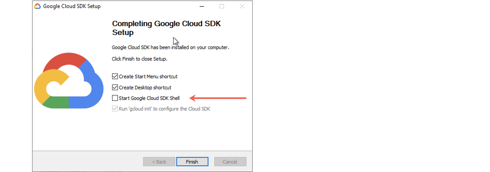
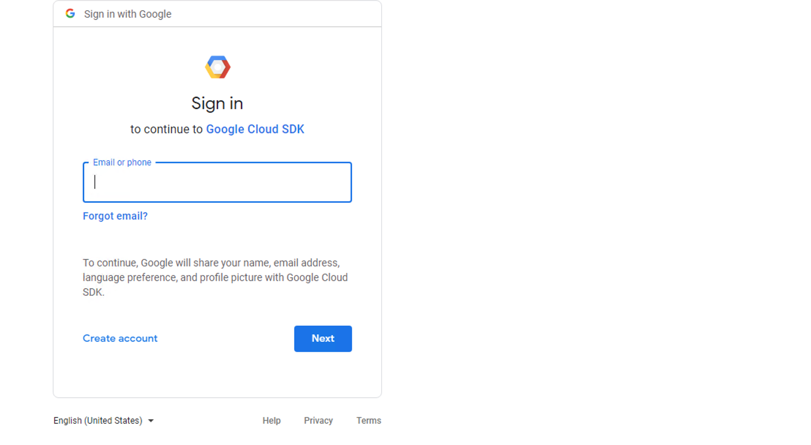
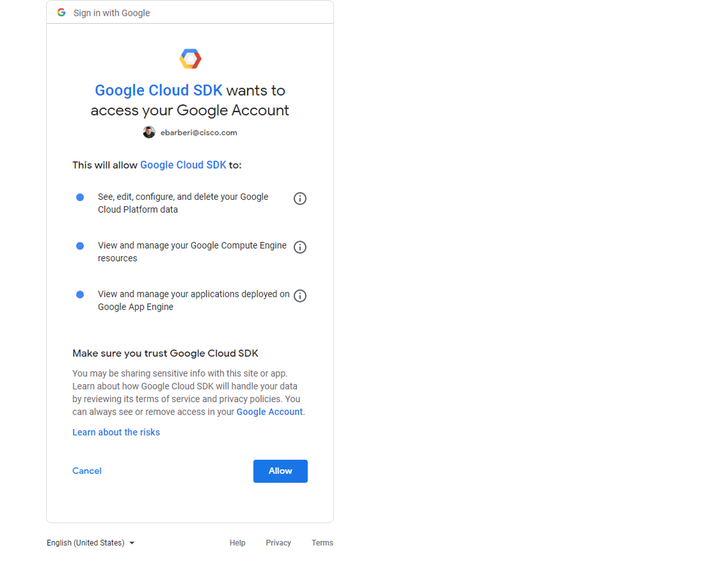
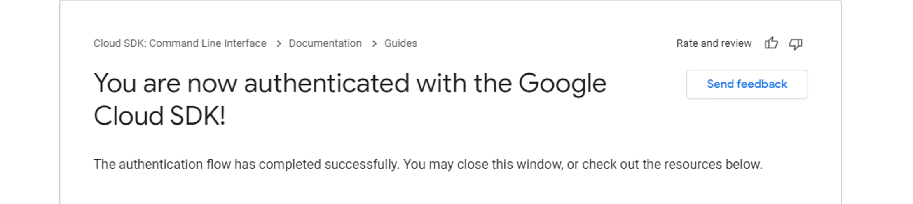
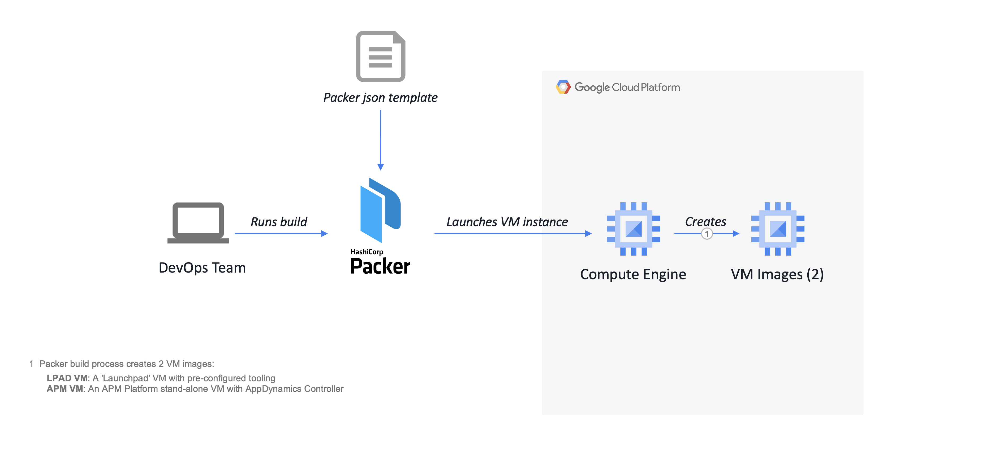
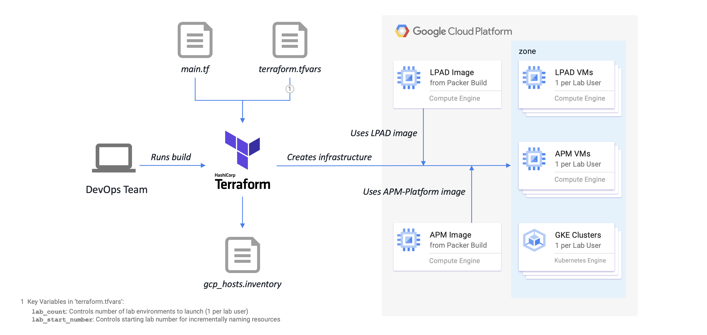

# Google Compute Engine (GCP) Image Build and Deployment Instructions

## Overview

Here is an example of the deployment architecture when deployed to the Google Cloud Platform:  

__AppD Cloud Kickstart: Workshop Deployment on GCP__


## Build and Deployment Steps

Before building and deploying the AppD Cloud Kickstart artifacts for GCP, you will need to install the 
Google Cloud SDK, which includes the `gcloud` CLI tool. The gcloud CLI manages authentication, local 
configuration, developer workflow, and interactions with the Google Cloud Platform APIs. It is the primary 
tool used to create and manage Google Cloud resources.  

The gcloud CLI will also allow you to cleanup and delete any resources created by the DevOps tooling when 
you are finished, such as purging old GCE images created by Packer.

## GCP-Specific Installation Instructions - macOS

Here is a list of the additional recommended software to be installed on the host macOS machine:

-	Google Cloud SDK 366.0.0 (command-line interface)

Perform the following steps to install the needed software:

1.	Install [Google Cloud SDK 366.0.0](https://cloud.google.com/sdk/docs/quickstart#mac).  
    `$ brew install --cask google-cloud-sdk`  

    Depending on your shell, follow the on-screen instructions to source the SDK binaries to your `PATH`.  

    For example, for Bash shell users, add the following to your `~/.bashrc` file:  

    ```bash
    source "/usr/local/Caskroom/google-cloud-sdk/latest/google-cloud-sdk/path.bash.inc"
    source "/usr/local/Caskroom/google-cloud-sdk/latest/google-cloud-sdk/completion.bash.inc"
    ```

2.	Validate installed command-line tool:

    ```bash
    $ gcloud --version
    Google Cloud SDK 366.0.0
    ...
    ```

## GCP-Specific Installation Instructions - Windows 64-Bit

Windows users have a wide variety of choice in command-line tools and shells for running the gcloud CLI, 
such as the Windows Command Prompt, [PowerShell](https://docs.microsoft.com/en-us/powershell/), 
[Windows Terminal](https://docs.microsoft.com/en-us/windows/terminal/get-started), 
[Git Bash](https://git-scm.com/download/win), and 
[The Windows Subsystem for Linux](https://docs.microsoft.com/en-us/windows/wsl/about).  

Although you are free to use any of these tools, the installation steps described below will be based on 
the usage of the **Git Bash** terminal for consistency.  

Here is a list of the additional recommended software to be installed on the host Windows machine:

-	Google Cloud SDK 366.0.0 (command-line interface)

Perform the following steps to install the needed software:

1.	Install [Google Cloud SDK 366.0.0](https://dl.google.com/dl/cloudsdk/channels/rapid/GoogleCloudSDKInstaller.exe) for Windows 64-bit.  
    Run the downloaded EXE installer, follow the on-screen instructions, and accept the defaults until you get to the last step.  

    **NOTE:** For Windows users, the EXE installation package offers a familiar and convenient way to 
    install the Google Cloud SDK without installing any other prerequisites. For more information, please visit 
    [Installing Google Cloud SDK](https://cloud.google.com/sdk/docs/install#windows) for Windows.  

    On the last step of the installer, uncheck the **Start Google Cloud SDK Shell** checkbox, which will 
    also grayout the **Run 'gcloud init' to configure the Cloud SDK** checkbox. We will perform these steps 
    later using the Git Bash terminal instead.  

    

2.	Open the **Git Bash** terminal and fix Python path errors in the `gcloud` shell script.  

    **NOTE:** As of this writing, the `gcloud` shell script contains invalid directory paths to the Python binary. Run the 
    following commands to correct the error:

    ```bash
    $ cd ~/AppData/Local/Google/Cloud\ SDK/google-cloud-sdk/bin
    $ cp -p gcloud gcloud.orig
    $ sed -i -e "s/bundledpythonunix\/bin\/python3/bundledpython\/python.exe/g" gcloud
    $ cd ~
    ```

3.	Using the **Git Bash** Terminal, validate the installed command-line tool:

    ```bash
    $ gcloud --version
    Google Cloud SDK 366.0.0
    ...
    ```

## Configuration and Validation

The configuration and validation steps are essentially identical for macOS and Windows 64-Bit systems. Perform the following steps to complete these tasks:  

1.	Configure the Google Cloud SDK from the command-line.  

    Run the 'gcloud init' command to launch an interactive Getting Started workflow for the command-line tool.  

    ```bash
    $ gcloud init
    ```

    You should see output similar to the following. When prompted, answer '**Y**' to log in:  

    ```bash
    Welcome! This command will take you through the configuration of gcloud.

    Your current configuration has been set to: [default]

    You can skip diagnostics next time by using the following flag:
      gcloud init --skip-diagnostics

    Network diagnostic detects and fixes local network connection issues.
    Checking network connection...done.
    Reachability Check passed.
    Network diagnostic passed (1/1 checks passed).

    You must log in to continue. Would you like to log in (Y/n)? Y
    ```

    You should see output similar to the following which will then launch your browser:  

    ```bash
    Your browser has been opened to visit:

    https://accounts.google.com/o/oauth2/auth?...
    ```

2.	Authorize gcloud and other SDK tools to access the Google Cloud Platform using your user account credentials.

    Sign-in to your Google account and click "Next":  

    

    <br>

    Enter your password if needed and then continue to the next screen.  

    <br>

    Click the "Allow" button to configure the Google Cloud SDK to authenticate using your Google account:  

    

    <br>

    You should now see a message like the one below:  

    

    <br>

    In your terminal, you should also receive a login message as follows:  

    ```bash
    You are logged in as: [yourusername@cisco.com].
    ```

3.	You will be prompted to select the GCP Cloud Project to use. For AppDynamics SEs, select '**gcp-appdcloudplatfo-nprd-68190**', which as of this writing is number '**2**'.

    ```bash
    Pick cloud project to use:
     [1] csbimages-prod-poy1
     [2] gcp-appdcloudplatfo-nprd-68190
     [3] Create a new project
    Please enter numeric choice or text value (must exactly match list
    item): 2
    ```

    You should see output similar to the following. When prompted, answer '**n**' to configure a default Compute Region and Zone. We will do that in a later step:  

    ```bash
    Your current project has been set to: [gcp-appdcloudplatfo-nprd-68190].

    Do you want to configure a default Compute Region and Zone? (Y/n)? n
    ```

    You should see output similar to the following:  

    ```bash
    Your Google Cloud SDK is configured and ready to use!

    * Commands that require authentication will use yourusername@cisco.com by default
    * Commands will reference project `gcp-appdcloudplatfo-nprd-68190` by default
    Run `gcloud help config` to learn how to change individual settings

    This gcloud configuration is called [default]. You can create additional configurations if you work with multiple accounts and/or projects.
    Run `gcloud topic configurations` to learn more.

    Some things to try next:

    * Run `gcloud --help` to see the Cloud Platform services you can interact with. And run `gcloud help COMMAND` to get help on any gcloud command.
    * Run `gcloud topic --help` to learn about advanced features of the SDK like arg files and output formatting
    ```

4.	Next, select the default GCP Cloud Region and Zone to use. For AppDynamics SEs, use Region '**us-central1**' and Zone '**us-central1-a**'.  

    ```bash
    $ gcloud config set compute/region us-central1
    $ gcloud config set compute/zone us-central1-a
    ```

5.	Finally, validate your Cloud SDK configuration:  

    ```bash
    $ gcloud config list
    ```

    You should see output similar to the following.  

    ```bash
    [compute]
    region = us-central1
    zone = us-central1-a
    [core]
    account = youruserame@cisco.com
    disable_usage_reporting = True
    project = gcp-appdcloudplatfo-nprd-68190

    Your active configuration is: [default]
    ```

## Prepare for the Build

All user credentials and installation inputs are driven by environment variables and can be configured within 
the `set_appd_cloud_kickstart_env.sh` script you will create in `./bin`. There are LOTS of options, but most 
have acceptable defaults. You only need to concentrate on a handful that are uncommented in the template file.

In particular, you will need to supply your AppDynamics login credentials to the 
[download site](https://accounts.appdynamics.com/downloads/).

The build will __fail__ if they are not set.

To prepare for the build, perform the following steps:

1.	Customize your AppD Cloud Kickstart project environment:

    Copy the template file and edit `set_appd_cloud_kickstart_env.sh` located in `./bin` to customize the 
    environment variables for your environment.

    ```bash
    $ cd /<drive>/projects/AppD-Cloud-Kickstart/bin
    $ cp -p set_appd_cloud_kickstart_env.sh.template set_appd_cloud_kickstart_env.sh
    $ vi set_appd_cloud_kickstart_env.sh
    ```

    The following environment variables are the most common to be overridden. They are grouped by sections in 
    the file, so you will have to search to locate the exact line. For example, the GCP-related variables are 
    at the end of the file.

    If you are building the GCE images in the `us-central1-a` zone (Iowa), the zone-related variables can be left alone.

    ```bash
    gcp_zone="us-central1-a"                        # example for Iowa.
    gcp_image_owner="<firstname>-<lastname>"        # gcp image owner label for packer builds.
                                                    # all lowercase; no spaces.
    ```

    Save and source the environment variables file in order to define the variables in your shell.

    ```bash
    $ source ./set_appd_cloud_kickstart_env.sh
    ```

    Validate the newly-defined environment variables via the following commands:

    ```bash
    $ env | grep -i ^gcp | sort
    $ env | grep -i ^appd | sort
    ```

2.	Create a secret key to a GCP Service Account with the appropriate IAM Policy Bindings:

	-	For AppDynamics SEs, the `gcp-devops.json` key file has already been created and can be download [here](https://drive.google.com/file/d/12wi_AzYHIDYd2q2SgNNSpxNwo2GmGgXS/view?usp=sharing).
		-	After downloading the secret key, it should be copied to the `shared/keys` directory.

3.	Supply a valid AppDynamics Controller license file:

	-	This license can be supplied by any AppDynamics SE
		-	It is recommended to have at least 10 APM, 10 server, 10 network, 5 DB, 1 unit of each Analytics and 1 unit of each RUM within the license key.
		-	Copy your AppDynamics Controller `license.lic` and rename it to `provisioners/scripts/centos/tools/appd-controller-license.lic`.

## Build the Immutable Images with Packer

Follow these instructions to build the GCE CentOS 7.9 images:

-	__LPAD VM__: A GCP GCE 'Launchpad' VM needed for Kubernetes and Serverless CLI Operations and running the sample apps.
-	__APM-Platform VM__: An APM Platform stand-alone VM with an AppDynamics Controller.

Here is an example of the Packer build flow for the Google Cloud Platform:

__Packer Build Flow for GCP__


1.	Build the __LPAD VM__ CentOS 7.9 AMI image:

    This will take several minutes to run. However, this build will be shorter than the APM-Platform VM 
    because the size of the root volume for the AMI image is much smaller.

    ```bash
    $ packer build lpad-centos79.json
    ```

2.	Build the __APM-Platform VM__ CentOS 7.9 AMI image:

    This will take several minutes to run.

    ```bash
    $ cd /<drive>/projects/AppD-Cloud-Kickstart/builders/packer/gcp
    $ packer build apm-platform-centos79.json
    ```

    If the build fails, check to ensure the accuracy of all variables edited above.

The steps for creating the AMI's are completed.

## Deploy the Infrastructure with Terraform

Follow these instructions to deploy the infrastructure and create Lab environments for each participant:

-	__LPAD VM__: Deploy the GCP GCE 'Launchpad' VMs.
-	__APM-Platform VM__: Deploy the APM Platform stand-alone VMs.
-	__GKE Kubernetes Cluster__: Deploy the GKE Kubernetes Clusters.

Here is an example of the Terraform build flow for the Google Cloud Platform:

__Terraform Build Flow for GCP__


__NOTE:__ The following steps are repeated for each major element of the workshop.

1.	Deploy the GCP GCE LPAD VMs.

	a.	Create the Terraform `terraform.tfvars` file. AppDynamics SEs can download an example (`.tfvars`) file
    [here](https://drive.google.com/file/d/1jlv0sNTyxNMgbpoq4RV4hJ1_xupB4raE/view?usp=sharing).

    __NOTE:__ The `terraform.tfvars` file is automatically loaded by Terraform and provides a convenient way to
    override input parameters found in [`variables.tf`](builders/terraform/gcp/gke-monitoring-lab/lpad/variables.tf). The two
    most important variables are:

    | Variable                        | Description                                                                                                                                                                                                                                                                                               |
    |---------------------------------|------------------------------------------------------------|
    | `lab_count`                     | Number of Lab environments to launch.
    | `lab_start_number`              | Starting lab number for incrementally naming Lab resources.

    <br>

    ```bash
    $ cd ~/projects/AppD-Cloud-Kickstart/builders/terraform/gcp/gke-monitoring-lab/lpad
    $ vi terraform.tfvars
    ...
    # set number of lab environments to launch with starting lab number.
    lab_count = 10
    lab_start_number = 1
    ...
    ```

	b.	Deploy the Lab infrastructure on GCP. Execute the following Terraform lifecycle commands in sequence:

    ```bash
    $ cd ~/projects/AppD-Cloud-Kickstart/builders/terraform/gcp/gke-monitoring-lab/lpad
    $ terraform --version
    $ terraform init
    $ terraform validate
    $ terraform plan -out terraform-lpad.tfplan
    $ terraform apply terraform-lpad.tfplan
    ```

2.	Deploy the APM Platform stand-alone VMs.

	a.	Repeat __Step a__ above to create the Terraform `terraform.tfvars` file.

    __NOTE:__ Make sure that the `lab_count` and `lab_start_number` variables are in-sync:

    | Variable                        | Description                                                                                                                                                                                                                                                                                               |
    |---------------------------------|------------------------------------------------------------|
    | `lab_count`                     | Number of Lab environments to launch.
    | `lab_start_number`              | Starting lab number for incrementally naming Lab resources.

    <br>

    ```bash
    $ cd ~/projects/AppD-Cloud-Kickstart/builders/terraform/gcp/gke-monitoring-lab/apm-platform
    $ vi terraform.tfvars
    ...
    # set number of lab environments to launch with starting lab number.
    lab_count = 10
    lab_start_number = 1
    ...
    ```

	b.	Deploy the Lab infrastructure on GCP. Execute the following Terraform lifecycle commands in sequence:

    ```bash
    $ cd ~/projects/AppD-Cloud-Kickstart/builders/terraform/gcp/gke-monitoring-lab/apm-platform
    $ terraform --version
    $ terraform init
    $ terraform validate
    $ terraform plan -out terraform-apm-platform.tfplan
            
    $ terraform apply terraform-apm-platform.tfplan
    ```

3.	Deploy the GKE Kubernetes Clusters.

	a.	Repeat __Step a__ above to create the Terraform `terraform.tfvars` file.

    __NOTE:__ Make sure that the `lab_count` and `lab_start_number` variables are in-sync:

    | Variable                        | Description                                                                                                                                                                                                                                                                                               |
    |---------------------------------|------------------------------------------------------------|
    | `lab_count`                     | Number of Lab environments to launch.
    | `lab_start_number`              | Starting lab number for incrementally naming Lab resources.

    <br>

    ```bash
    $ cd ~/projects/AppD-Cloud-Kickstart/builders/terraform/gcp/gke-monitoring-lab/gke-cluster
    $ vi terraform.tfvars
    ...
    # set number of lab environments to launch with starting lab number.
    lab_count = 10
    lab_start_number = 1
    ...
    ```

	b.	Deploy the Lab infrastructure on GCP. Execute the following Terraform lifecycle commands in sequence:

    ```bash
    $ cd ~/projects/AppD-Cloud-Kickstart/builders/terraform/gcp/gke-monitoring-lab/gke-cluster
    $ terraform --version
    $ terraform init
    $ terraform validate
    $ terraform plan -out terraform-gke-cluster.tfplan
    $ terraform apply terraform-gke-cluster.tfplan
    ```

## Cleaning-Up when the Workshop is Over

1.	To teardown the Lab infrastructure on GCP, execute the following Terraform command:

    ```bash
    $ cd ~/projects/AppD-Cloud-Kickstart/builders/terraform/gcp/gke-monitoring-lab/lpad
    $ terraform destroy -auto-approve

    $ cd ~/projects/AppD-Cloud-Kickstart/builders/terraform/gcp/gke-monitoring-lab/apm-platform
    $ terraform destroy -auto-approve

    $ cd ~/projects/AppD-Cloud-Kickstart/builders/terraform/gcp/gke-monitoring-lab/gke-cluster
    $ terraform destroy -auto-approve
    ```

## When Things Go Wrong

### Packer

Problems with Packer generally occur during the provisioning phase. During this phase, all of the provisioning 
steps __*must*__ complete successfully or the build will fail. Pay attention to the error in the output, and 
adjust the build provisioning script accordingly.

If a network timeout occurs, you can generally wait a few minutes and restart the build to be successful.

### Terraform

Problems with Terraform generally occur when it gets confused about the state of existing infrastructure resources or
if it tries to create a resource that already exists.  

For state issues, the quickest remedy is to destroy the infrastructure and recreate it. In some cases, you may have
to manually browse the cloud provider and delete any resources that are in conflict.

## GCP CentOS 7.9 Bill-of-Materials

__LPAD VM__ - The following CLI command-line tools and utilities are pre-installed:

-	Ansible 2.9.27
-	AppDynamics Node.js Serverless Tracer 21.11.348
-	Docker 20.10.11 CE
	-	Docker Bash Completion
	-	Docker Compose 1.29.2
	-	Docker Compose Bash Completion
-	Git 2.34.1
	-	Git Bash Completion
	-	Git-Flow 1.12.3 (AVH Edition)
	-	Git-Flow Bash Completion
-	Google Cloud SDK 366.0.0
-	Helm CLI 3.7.2 (Package Manager for Kubernetes)
-	Java SE JDK 8 Update 312 (Amazon Corretto 8)
-	Java SE JDK 11.0.13 (Amazon Corretto 11)
-	Java SE JDK 17.0.1 (Amazon Corretto 17)
-	jq 1.6 (command-line JSON processor)
-	Kubernetes CLI [kubectl] 1.19.7 (command-line interface)
-	Node.js JavaScript runtime v16.13.1 (Latest LTS Version)
-	npm JavaScript Package Manager for Node.js 8.3.0
-	nvm (Node Version Manager) bash script 0.39.0
-	Packer 1.7.8
-	Python 2.7.5
	-	Pip 21.3.1
-	Python 3.6.8
	-	Pip 21.3.1
-	Serverless Framework CLI 2.69.0
-	Terraform 1.1.0
-	VIM - Vi IMproved 8.2
-	yq 4.16.1 (command-line YAML processor)

__APM-Platform VM__ - The following utilities and application performance management applications are pre-installed:

-	Ansible 2.9.27
-	AppDynamics Enterprise Console 21.4.9 Build 24662
	-	AppDynamics Controller 21.4.9 Build 1435
	-	AppDynamics Events Service 4.5.2 Build 20651
-	Docker 20.10.11 CE
	-	Docker Bash Completion
	-	Docker Compose 1.29.2
	-	Docker Compose Bash Completion
-	Git 2.34.1
	-	Git Bash Completion
	-	Git-Flow 1.12.3 (AVH Edition)
	-	Git-Flow Bash Completion
-	Google Cloud SDK 366.0.0
-	Java SE JDK 8 Update 312 (Amazon Corretto 8)
-	jq 1.6 (command-line JSON processor)
-	MySQL Shell 8.0.27
-	Python 2.7.5
	-	Pip 21.3.1
-	Python 3.6.8
	-	Pip 21.3.1
-	VIM - Vi IMproved 8.2
-	yq 4.16.1 (command-line YAML processor)
