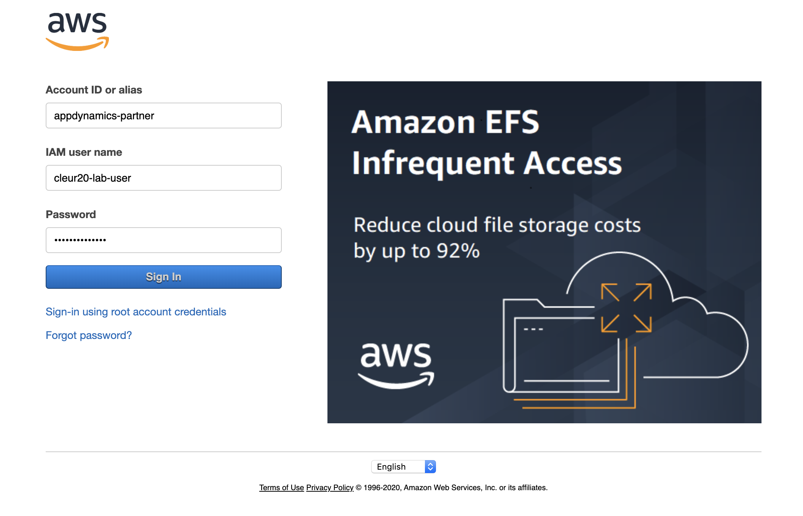
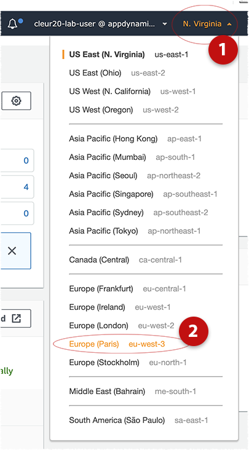
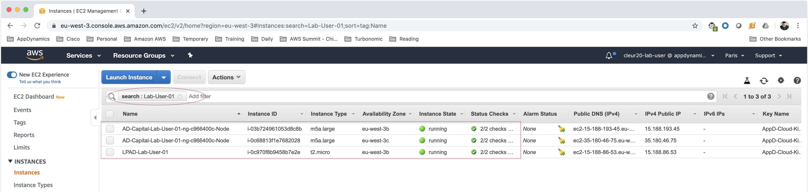
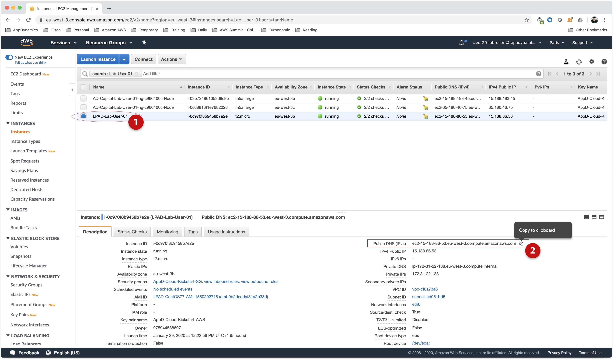

# Lab Exercise 1
## Login to the AWS Console and Locate Your Lab EC2 Instance.
### (e.g. Launch Pad EC2)

The Launch Pad EC2 instance is used to execute all the steps needed for the configuration and management of the Kubernetes (AWS EKS) cluster. It comes pre-installed with utilities like AWS CLI, kubectl, eksctl, etc.

In this exercise you will use the **AWS Management Console** to locate your Lab EC2 instance that will be used to clone two GitHub repositories and configure the EKS cluster in the next lab exercise. This EC2 instance will be referenced in the lab steps as the **Launch Pad EC2**.

For your information only, the Launch Pad EC2 is based on a pre-built AMI image named **LPAD-CentOS77-AMI** located in the AWS region that you are working in.

**NOTE:** Before beginning, please make note of your assigned Lab User ID: **Lab-User-01**, **Lab-User-02**, **Lab-User-03**, etc. You will make extensive use of your ID in the remaining exercises.

 

To begin Lab Exercise 1, open your browser and navigate to the [AWS Management Console](https://appdynamics-partner.signin.aws.amazon.com/console).

  1. Login with the credentials supplied by your lab instructor.
     

  2. In the **Find Services** textbox, type **EC2**, and click the link for **EC2 Virtual Servers in the Cloud**
  3. If not already selected, Select **Europe (Paris) eu-west-3** from the AWS Region dropdown menu in the upper-right.
     

  4. Click the **Running instances** link under "Resources".
  5. Under the **Launch Instance** button, type your Lab ID in the **Filter by tags and attributes or search by keyword** textbox.
     **For example**, if you were assigned Lab-User-01, type **Lab-User-01** to filter the running EC2 instances.
     You should see 3 running EC2 instances as shown.
     

  6. Select your LPAD-Lab-User-XX instance. In the description section down below, click the copy icon to copy the
     Public DNS (IPv4) URL to the clipboard.
     

**NOTE:** Make note of the Public IP Address (FQDN) of the server. You will be leveraging this server in the remainder of the lab.

 

[Overview](aws-eks-monitoring.md) | 1, [2](lab-exercise-02.md), [3](lab-exercise-03.md), [4](lab-exercise-04.md), [5](lab-exercise-05.md), [6](lab-exercise-06.md) | [Back](aws-eks-monitoring.md) | [Next](lab-exercise-02.md)
