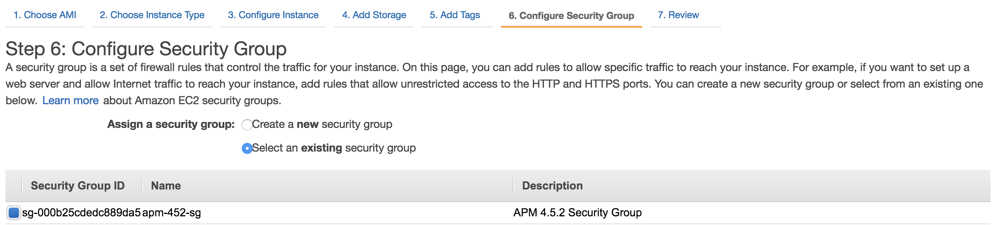

# Lab Exercise 1
## Launch the First EC2 Instance (e.g. Launch Pad EC2).

This is going to be used to execute all the steps needed for installation. The Launch Pad Comes preinstalled with utilities like AWSCLI, kubectl etc.

In this exercise you will use the [AWS Management Console](https://aws.amazon.com/console/) to launch the first EC2 instance that will be used to clone two Github repositories and create the EKS cluster in the next lab step.

This EC2 instance will be referenced in the lab steps as the 'Launch Pad EC2'.

You will need to use an existing AMI image named **LPAD-EKS-AL2-AMI** and located in the AWS region that you are working in:

**NOTE:** Though any region can be utilized, this workshop does create a VPC and utilizes an elastic IP address. You may run into issues with these default limits. In the AppDynamics AWS environment, these limits have been increased in us-east-1. If you are internal to AppD, it is recommended to utilize this region. For clients, know these limits may impact the ability to create a EKS Cluster later on.

- The AMI image for the **us-west-1** region can be found [here](https://us-west-1.console.aws.amazon.com/ec2/v2/home?region=us-west-1#Images:sort=tag:Name).
- The AMI image for the **us-west-2** region can be found [here](https://us-west-2.console.aws.amazon.com/ec2/v2/home?region=us-west-2#Images:sort=tag:Name).
- The AMI image for the **us-east-1** region can be found [here](https://us-east-1.console.aws.amazon.com/ec2/v2/home?region=us-east-1#Images:sort=tag:Name).
- The AMI image for the **us-east-2** region can be found [here](https://us-east-2.console.aws.amazon.com/ec2/v2/home?region=us-east-2#Images:sort=tag:Name).

<br>

Once you have identified the appropriate AMI, launch an instance of it via:

  1. Select the AMI > Launch
  2. Select General Purpose "t2.micro"
  3. Click "Configure Instance Details" in the bottom right
  4. Keep all default values
  5. Scroll to the bottom and Expand Advanced

Once 'Advanced' is expanded, enter the following 'User data' commands.

This allows you to configure the EC2 instance during launch.

Before continuing, you will need to define the **AWS_ACCESS_KEY_ID** and **AWS_SECRET_ACCESS_KEY** environment
variables with valid credentials for your environment. If you are NOT working in the 'us-west-2' region, also
uncomment and set the **aws_cli_default_region_name**. Please note the variables are case sensitive:

```
#!/bin/sh
cd /opt/appd-cloud-kickstart/provisioners/scripts/aws
chmod 755 ./initialize_al2_lpad_eks_cloud_init.sh

# Set unique AWS CLI config parameters.
AWS_ACCESS_KEY_ID=""
export AWS_ACCESS_KEY_ID
AWS_SECRET_ACCESS_KEY=""
export AWS_SECRET_ACCESS_KEY
#aws_cli_default_region_name="us-east-2"    # Default is 'us-west-2'. Uncomment if in 'us-east-2'.
#export aws_cli_default_region_name

./initialize_al2_lpad_eks_cloud_init.sh
```

If the above section is not completed at VM creation, the launchpad server will not function as intended.

   6. Select on "Add Storage" tab and chose default options.
   7. Next Select on "Add Tags" tab. Add one tag. [Key = Name , Value = User_Lapad_Initials].

     Example of Value field:
     User Name: John Calvin Smith
     
     Key = Name
     Value=User-Lpad-JCS

   8. Next Select the "Configure Security Group" tab. Select the following group from the drop down.



   9. Review and Launch your VM. When prompted for a KeyValue pair--and if you are internal to AppD--select the KickStarter pem if you have access to it.  You can request this key from the workshop creators, and / or provide it to associates taking the workshop.

**NOTE:** Once the VM is launched, take note of the FQDN of the server. You will be leveraging this server in the remainder of the lab.

   9. Update Security group
   .......

<br>

[Overview](aws-eks-monitoring.md) | [1](lab-exercise-01.md), [2](lab-exercise-02.md), [3](lab-exercise-03.md), [4](lab-exercise-04.md), [5](lab-exercise-05.md), [6](lab-exercise-06.md) | [Back](aws-eks-monitoring.md) | [Next](lab-exercise-02.md)
