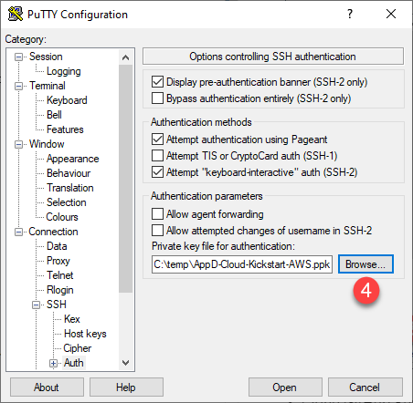
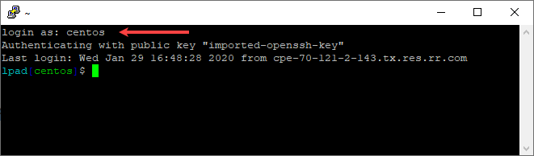
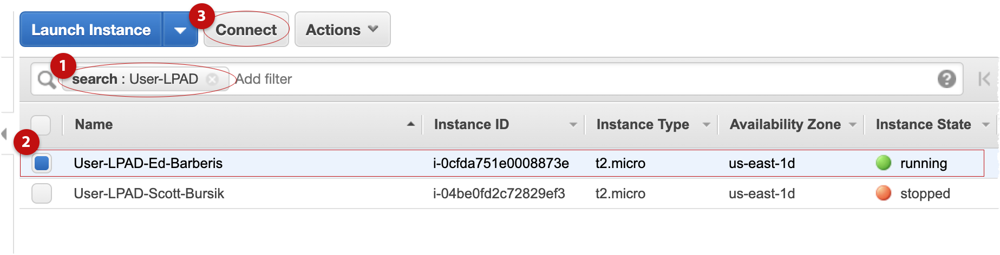
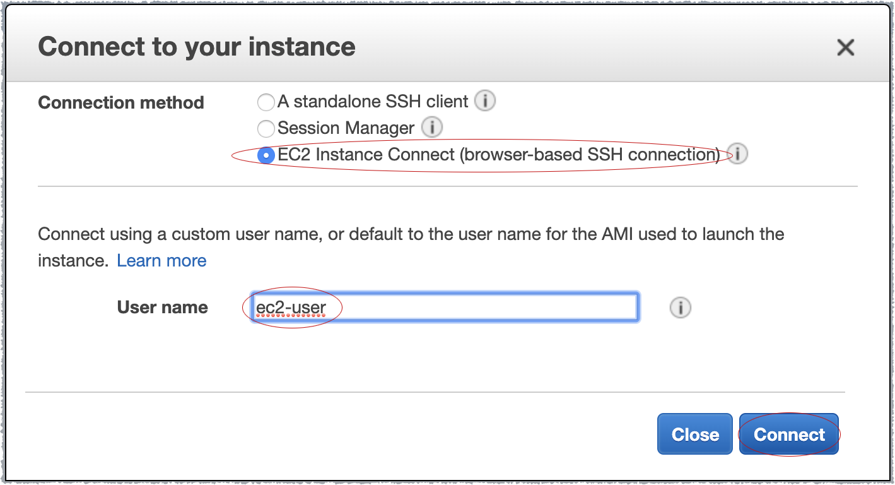
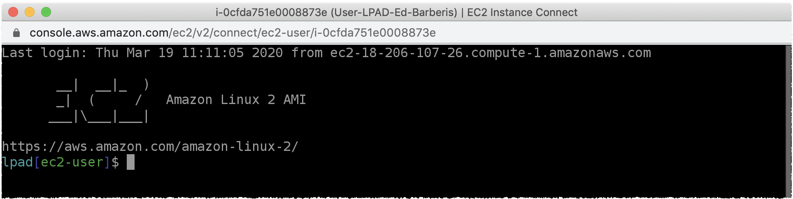
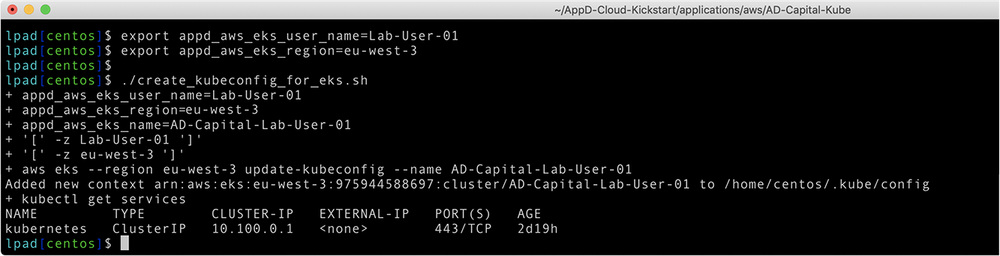

# Lab Exercise 2
## Clone GitHub Repository & Configure EKS Cluster

This workshop takes previously configured docker-compose applications (AD-Capital-Kube) and makes them deployable to a kubernetes cluster. If you are curious about any of the repositiories; either the original java application code itself or the dockerized version, they are publicly available with detailed explanations as to what they contain. For the purpose of this walkthrough, it will be focused solely on Kubernetes.

In this exercise you will need to do the following:

- SSH into the Launch Pad EC2 instance
- Clone GitHub repository
- Run a script to connect to an EKS cluster

### **1.** SSH Into the Launch Pad EC2 Instance
You will need a copy of the `AppD-Cloud-Kickstart-AWS.pem` file in order to SSH into your Launch Pad EC2 instance. You can obtain a copy of the `AppD-Cloud-Kickstart-AWS.pem` file from your lab instructor.  

Otherwise: If you created a new SSH key pair in [Lab Exercise 1](lab-exercise-01.md), remember to substitute the name of your downloaded '.pem' file for 'AppD-Cloud-Kickstart-AWS.pem' in all of the remaining lab exercise steps.  
<br>
You will use the user name '**ec2-user**' with no password to SSH into the Launch Pad EC2 instance.
<br><br>

***For Mac Users:***

Run the command below from a terminal window, with the path to your copy of the `AppD-Cloud-Kickstart-AWS.pem` file and the host name or IP Address of your Launch Pad EC2 instance
```
chmod 400 <path-to-file>/AppD-Cloud-Kickstart-AWS.pem
ssh -i <path-to-file>/AppD-Cloud-Kickstart-AWS.pem <hostname-of-your-launch-pad-ec2-instance>
```

Example:
```
ssh -i AppD-Cloud-Kickstart-AWS.pem ec2-user@ec2-54-214-99-204.us-east-1.compute.amazonaws.com
```

<br>

***For Windows Users:***

You will need [PuTTY](https://www.putty.org/) or another SSH client installed to SSH into the Launch Pad EC2 instance
<br>

If you are using PuTTY, you can find the instructions to convert the pem file to a ppk file in the link provided below:

https://docs.aws.amazon.com/AWSEC2/latest/UserGuide/putty.html#putty-private-key

Once you have converted the pem file to a ppk file, you can configure PuTTY to SSH into the Launch Pad EC2 instance using the steps below.

1. Enter the public host name or IP address of your LPAD instance
2. Enter a name for your session to your LPAD instance
3. Click on the Auth option under SSH
4. Click on the Browse button to select your PPK file
5. Click on the Session option at the top of the tree on the left
6. Click on the Save button and your session will be added to the list
7. Click on the Open button to start your session





When your session opens you will be prompted for your user name.  Enter your user name, no password is required.



<br>

***For Browser Users:***

If you are using your browser to connect, navigate to the EC2 Dashboard and select the 'Running instances' link.
You can now connect to your Launch Pad EC2 instance using the steps below:

1. Filter running EC2 instances by entering the name of your VM. For example, 'User-LPAD'.
2. Click to select your LPAD instance.
3. Click the 'Connect' button.



4. Select the 'EC2 Instance Connect (browser-based SSH connection)' radio button.
5. In the 'User name' text box, enter 'ec2-user'.
6. Click the 'Connect' button.



7. Verify that your terminal window is connected.



<br><br>

***After Logging In:***

**NOTE:** If you created your own SSH key pair, you will need to set the value of the '**appd_aws_eks_ssh_public_key**' environment variable with the name of your key. The default is '**AppD-Cloud-Kickstart-AWS**'.

```
export appd_aws_eks_ssh_public_key=your-unique-ssh-key
```
<br>

### **2.** Clone GitHub Repository

Once you have an SSH command terminal open to the EC2 instance for the launch pad, you need to clone the GitHub repository by running the commands below:

```
cd /home/ec2-user

git clone https://github.com/Appdynamics/AppD-Cloud-Kickstart.git
```

After you run the command, you should have this folder in your home directory

*/home/ec2-user/AppD-Cloud-Kickstart*


<br>

### **3.** Connect to the EKS Cluster

Change to the directory where you will prepare to connect to your AWS EKS cluster and create a local `kubeconfig`:

```
cd /home/ec2-user/AppD-Cloud-Kickstart/applications/aws/AD-Capital-Kube
```
<br>

Next, you will need to set two environment variables. The first variable, '**appd_aws_eks_user_name**', needs special instructions, so please read carefully.  

<br>

**It is VERY IMPORTANT that the 'appd_aws_eks_user_name' variable BE UNIQUE TO YOU !!!**  

This variable is used as the name of the EKS cluster and the cluster configuration will fail if do not follow this step properly. It could also interfere with another persons cluster with the same name if they are running commands to configure the cluster when you are.

It is advisable to set the '**appd_aws_eks_user_name**' variable to a value that was assigned to your by your lab instructor to ensure a unique cluster name.

Example:
<br>

Lab User Name: **Lab-User-01**

The example command based on the lab user name and number sequence show above:

*export appd_aws_eks_user_name=Lab-User-01*

<br>

Run the command below, replacing 'your-unique-lab-user-id' with the unique lab user id you were assigned based on the instructions above:
```
export appd_aws_eks_user_name=your-unique-lab-user-id
```
<br>

The second variable ('**appd_aws_eks_region**') needs to specify the AWS region that you are working in.  
Currently, only the five regions below are supported.

- us-east-1
- us-east-2
- us-west-2
- eu-west-2
- eu-west-3

<br>

If you are working in the **us-east-1** region, run the command below:
```
export appd_aws_eks_region=us-east-1
```

If you are working in the **us-east-2** region, run the command below:
```
export appd_aws_eks_region=us-east-2
```

If you are working in the **us-west-2** region, run the command below:
```
export appd_aws_eks_region=us-west-2
```

If you are working in the **eu-west-2** region, run the command below:
```
export appd_aws_eks_region=eu-west-2
```

If you are working in the **eu-west-3** region, run the command below:
```
export appd_aws_eks_region=eu-west-3
```


<br>

Once both variables have been set, run the commands below to connect to your AWS EKS cluster and create a local `kubeconfig`:

```
cd /home/ec2-user/AppD-Cloud-Kickstart/applications/aws/AD-Capital-Kube

./create_kubeconfig_for_eks.sh

```

<br>

Check to see if the output from the command is similar to the image seen below:

<br>



[Overview](aws-eks-monitoring.md) | [1](lab-exercise-01.md), 2, [3](lab-exercise-03.md), [4](lab-exercise-04.md), [5](lab-exercise-05.md), [6](lab-exercise-06.md) | [Back](lab-exercise-01.md) | [Next](lab-exercise-03.md)
