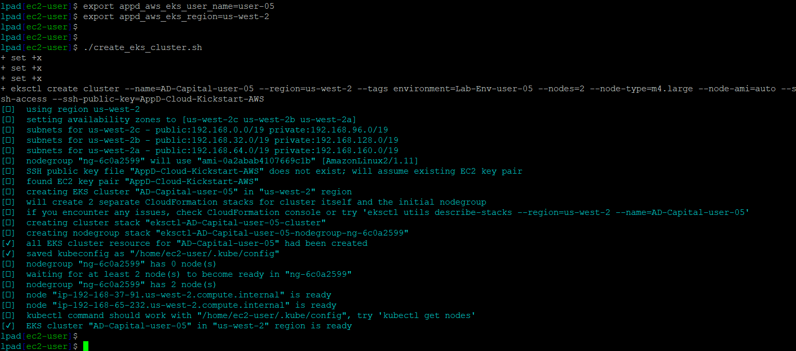

# Lab Exercise 2
## Clone Github Repositories & Create EKS Cluster

In this exercise you will need to do the following:

- SSH into the Launch Pad EC2 instance
- Clone two Github repositories
- Run a script to create a new EKS cluster

<br>

### **1.** SSH Into the Launch Pad EC2 Instance
You will need a copy of the 'AppD-Kickstarter-AWS.pem' file in order to SSH into your Launch Pad EC2 instance.  

You can obtain a copy of the 'AppD-Kickstarter-AWS.pem' file from your lab instructor.

If you can't get a copy of the 'AppD-Kickstarter-AWS.pem' file, you will need to do the following:

- Create your own key pair in the AWS EC2 console
- Launch an instance of the Launch Pad EC2 that uses your key pair
- Modify the value of the 'appd_aws_eks_ssh_public_key' variable in the 'create_eks_cluster.sh' script found in */home/ec2-user/AppD-Cloud-Kickstart/applications/aws/AD-Capital-Kube* so the value is the name of the key pair you created in the AWS EC2 console

<br>
You will use the user name ec2-user with no password to SSH into the Launch Pad EC2 instance,
<br><br>


***For Mac Users:***

Run the command below from a terminal window, with the path to your copy of the 'AppD-Kickstarter-AWS.pem' file and the host name or IP Address of your Launch Pad EC2 instance
```
ssh -i <path-to-file>/AppD-Kickstarter-AWS.pem <hostname-of-your-launch-pad-ec2-instance>
```

Example: 
```
ssh -i /Users/john.smith/Documents/AppD-Kickstarter-AWS.pem ec2-user@ec2-54-214-99-204.us-west-2.compute.amazonaws.com
```

<br>

***For Windows Users:***

You will need [PuTTY](https://www.putty.org/) or another SSH client installed to SSH into the Launch Pad EC2 instance
<br>

If you are using PuTTY, you can find the instructions to convert the pem file to a ppk file in the link provided below:

https://docs.aws.amazon.com/AWSEC2/latest/UserGuide/putty.html#putty-private-key


<br>

### **2.** Clone Github Repositories

Once you have an SSH command terminal open to the EC2 instance for the launch pad, you need to clone two Github repositories by running the commands below:

```
cd /home/ec2-user

git clone https://github.com/Appdynamics/AppD-Cloud-Kickstart.git

cd /home/ec2-user

git clone https://github.com/Appdynamics/AD-Capital-Kube.git
```

After you run the commands, you should have two new folders in your home directory

*/home/ec2-user/AD-Capital-Kube*

*/home/ec2-user/AppD-Cloud-Kickstart*



<br>

### **3.** Create EKS Cluster

Change to the directory where you will set permissions on the scripts used in the next steps by running the commands below:

```
cd /home/ec2-user/AppD-Cloud-Kickstart/applications/aws/AD-Capital-Kube
chmod -R 775 .
```
<br>
Next you will need to set two environment variables before you run the script to create the EKS cluster. The first variable ('appd_aws_eks_user_name') needs special instructions, read carefully.

**It is VERY IMPORTANT that the 'appd_aws_eks_user_name' variable BE UNIQUE TO YOU !!!**  

This variable is used as the name of the EKS cluster and the cluster creation will fail if there is any existing cluster with the same name and could also interfere with another persons cluster with the same name if they are running the script to create the cluster when you are.

It is advisable to set the 'appd_aws_eks_user_name' variable to a value that is a combination of your name or initials combined with a random number sequence to ensure a unique cluster name.

Example: 
<br>

Users Name: **John Calvin Smith**

Random Number Sequence: **19-51-28**

example command based on users name and random number sequence show above

*export appd_aws_eks_user_name=User-JCS-19-51-28*

<br>

Run the command below, replacing 'your-unique-user-id' with the unique user id you created based on the instructions above: 
```
export appd_aws_eks_user_name=your-unique-user-id
```
<br>

The second variable ('appd_aws_eks_region') needs to specify the AWS region that you are working in.  Currently, only the four regions below are supported.

- us-east-1
- us-east-2
- us-west-1
- us-west-2

<br>

If you are working in the **us-east-1** region, run the command below:
```
export appd_aws_eks_region=us-east-1
```

If you are working in the **us-east-2** region, run the command below:
```
export appd_aws_eks_region=us-east-2
```

If you are working in the **us-west-1** region, run the command below:
```
export appd_aws_eks_region=us-west-1
```

If you are working in the **us-west-2** region, run the command below:
```
export appd_aws_eks_region=us-west-2
```


<br>

Once both variables have been set, run the commands below to create the EKS cluster. 

```
cd /home/ec2-user/AppD-Cloud-Kickstart/applications/aws/AD-Capital-Kube

./create_eks_cluster.sh
```

<br>

You should start to see output from the command that is similar to the image seen below: 

- Leave the exiting SSH terminal window open and running
- The cluster creation command will take roughly 15 minutes to finish 
- You can proceed to [Lab Exercise 3](lab-exercise-03.md) at this point

<br>


<br>

[Overview](aws-eks-monitoring.md) | [1](lab-exercise-01.md), [2](lab-exercise-02.md), [3](lab-exercise-03.md), [4](lab-exercise-04.md), [5](lab-exercise-05.md), [6](lab-exercise-06.md) | [Back](lab-exercise-01.md) | [Next](lab-exercise-03.md)