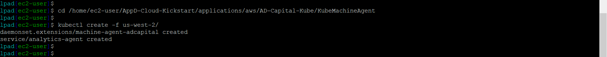

# Lab Exercise 5
## Delpoy the Server Agent & Network Agent to EKS


In this exercise you will need to do the following:

- Deploy the Server Monitoring Agent to EKS
- Monitor the Servers in the Controller
- Deploy the Network Agent to EKS
- Monitor the Network in the Controller

<br>

### **1.** Deploy the Server Monitoring Agent to EKS

Using the SSH terminal for the Launch Pad EC2 instance, change to the directory to deploy the Server Monitoring Agent by running the command below:

```
cd /home/ec2-user/AppD-Cloud-Kickstart/applications/aws/AD-Capital-Kube/KubeMachineAgent
```
Depending on what AWS region you deployed the AD-Capital application to in the previous exercise, **run only one** of the following commands below which correspond to your AWS region to deploy the Server Monitoring agent:

```
kubectl create -f us-west-2/
```

```
kubectl create -f us-east-2/
```

You should see output from the command similar to the image seen below:



Now wait two minutes and run the command below to validate that the agent has been deployed to the cluster:

```
kubectl get pods -n default
```
You should then see output similar to the image seen below:


<br>

### **2.** Monitor the Servers in the Controller

Wait four minutes and go to your web browser and check the controller to see if the servers are reporting to the controller.  You should see what the image below shows when you click on the Servers tab on the top menu:


<br>

### **3.** Deploy the Network Agent to EKS

Using the SSH terminal for the Launch Pad EC2 instance, change to the directory to deploy the Network Monitoring Agent by running the command below:

```
cd /home/ec2-user/AD-Capital-Kube
```
Now run the following command below to deploy the Server Monitoring agent:

```
kubectl create -f KubernetesNetVisAgent/
```

You should see output from the command similar to the image seen below:


Now wait two minutes and run the command below to validate that the agent has been deployed to the cluster:

```
kubectl get pods -n default
```
You should then see output similar to the image seen below:


<br>

### **4.** Monitor the Network in the Controller

Wait six minutes and go to your web browser and check the controller to see if the network agents are reporting to the controller.  You should see what the image below shows when you click on the Network Dashboard tab within the AD-Capital Application Dashboard view:


<br>

[Overview](aws-eks-monitoring.md) | [1](lab-exercise-01.md), [2](lab-exercise-02.md), [3](lab-exercise-03.md), [4](lab-exercise-04.md), [5](lab-exercise-05.md), [6](lab-exercise-06.md) | [Back](lab-exercise-04.md) | [Next](lab-exercise-06.md)