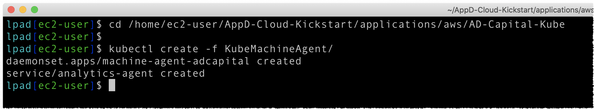
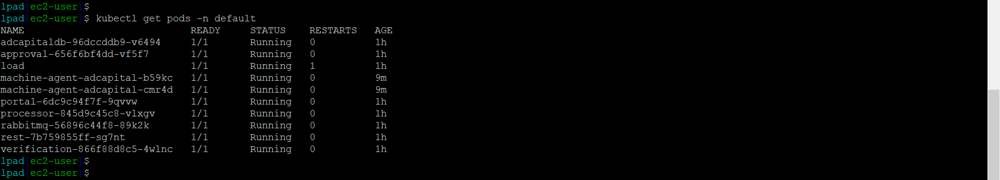
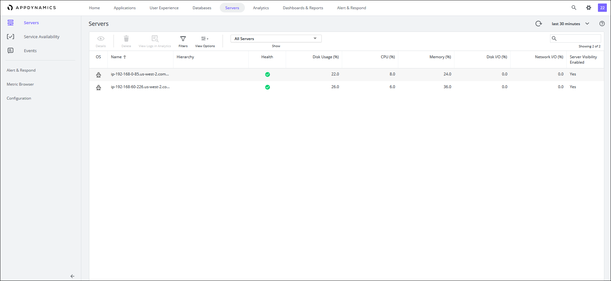
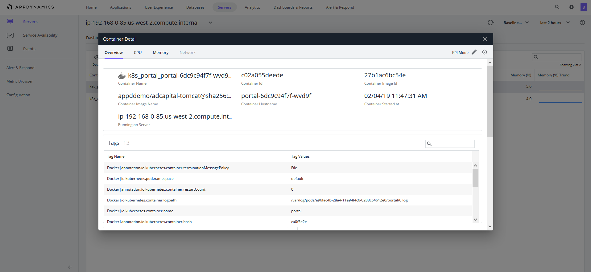
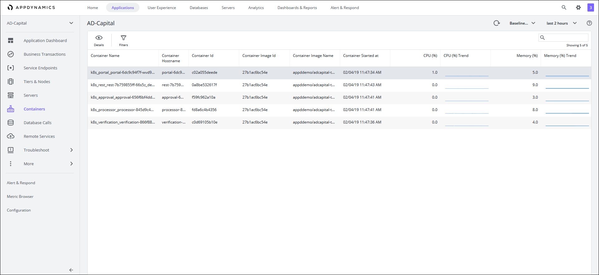
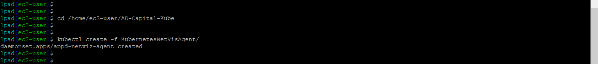
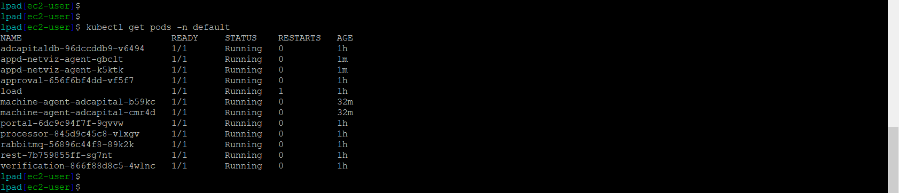
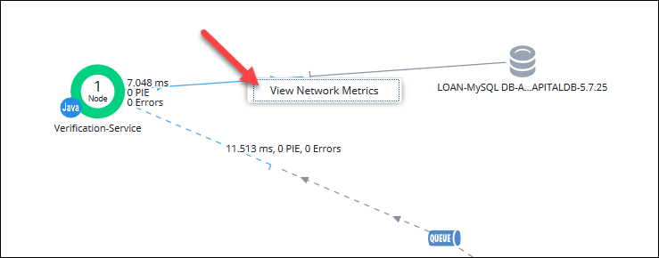

# Lab Exercise 5
## Deploy the Server Agent & Network Agent to EKS


In this exercise you will need to do the following:

- Deploy the Server Monitoring Agent to EKS
- Monitor the Servers in the Controller
- Deploy the Network Agent to EKS
- Monitor the Network in the Controller

<br>

### **1.** Deploy the Server Monitoring Agent to EKS

Server monitoring Agents collect machine and infrastructure-level metrics like Disk I/O, throughput, CPU utilization, and memory usage. These metrics help operations teams get a pulse on their infrastructure, but they fall short when it comes to finding, isolating and troubleshooting problems that originate in the application code. Machine agent is required to host extension. In this workshop we will Kubernetes Extension which requires Machine agent as well.

Using the SSH terminal for the Launch Pad EC2 instance, change to the directory to deploy the Server Monitoring Agent by running the command below:

```bash
cd /home/ec2-user/AppD-Cloud-Kickstart/applications/aws/AD-Capital-Kube
```

<br>

To deploy the Server Monitoring Agent to EKS, run the command below:
```bash
kubectl create -f KubeMachineAgent/
```

You should see output from the command similar to the image seen below:



Now wait two minutes and run the command below to validate that the agent has been deployed to the cluster:

```bash
kubectl get pods -n default
```
You should then see output similar to the image seen below:




<br>

### **2.** Monitor the Servers in the Controller

Wait four minutes and go to your web browser and check the controller to see if the servers are reporting to the controller.  You should see what the image below shows when you click on the Servers tab on the top menu:



<br>

Navigate into the AD-Capital application and click on the Servers tab on the left menu.  You should see what the image shows below.  The AppDynamics server agent has automatically associated the servers with the application:


<br>

Double click on one the servers in the view.  You should see what the image shows below. Explore the different dashboards across the horizontal tab for the server (e.g. Processes, Volumes, Containers):


<br>

Drill into the Containers tab and double click on one of the containers to view the detail of the container as seen in the image below:



<br>

Navigate back into the AD-Capital application and click on the Containers tab on the left menu to see a summary of all the running containers for the application:




<br>

### **3.** Deploy the Network Agent to EKS

Using the SSH terminal for the Launch Pad EC2 instance, change to the directory to deploy the Network Monitoring Agent by running the command below:

```bash
cd /home/ec2-user/AppD-Cloud-Kickstart/applications/AD-Capital-Kube
```
Now run the following command below to deploy the Server Monitoring agent:

```bash
kubectl create -f KubernetesNetVisAgent/
```

You should see output from the command similar to the image seen below:



Now wait two minutes and run the command below to validate that the agent has been deployed to the cluster:

```bash
kubectl get pods -n default
```
You should then see output similar to the image seen below:




<br>

### **4.** Monitor the Network in the Controller

Wait six minutes and go to your web browser and check the controller to see if the network agents are reporting to the controller.  You should see what the image below shows when you click on the Network Dashboard tab within the AD-Capital Application Dashboard view:


<br>

Now right click on the blue line connecting the 'Verification-Service' tier to the 'LOAN-MySQL DB-ADCAPITALDB-5.7.25' database and click on the 'View Network Metrics' option:




<br>

You should see an image like the one below that shows the network metrics for the connection between the Verification-Service and the database:


<br>

Back on the main Network Dashboard, click on the Explorer link under Connections near the top right of the screen to see a summary of all the connections like the image below:


<br>

[Overview](aws-eks-monitoring.md) | [1](lab-exercise-01.md), [2](lab-exercise-02.md), [3](lab-exercise-03.md), [4](lab-exercise-04.md), 5, [6](lab-exercise-06.md) | [Back](lab-exercise-04.md) | [Next](lab-exercise-06.md)
