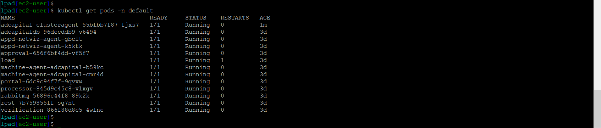
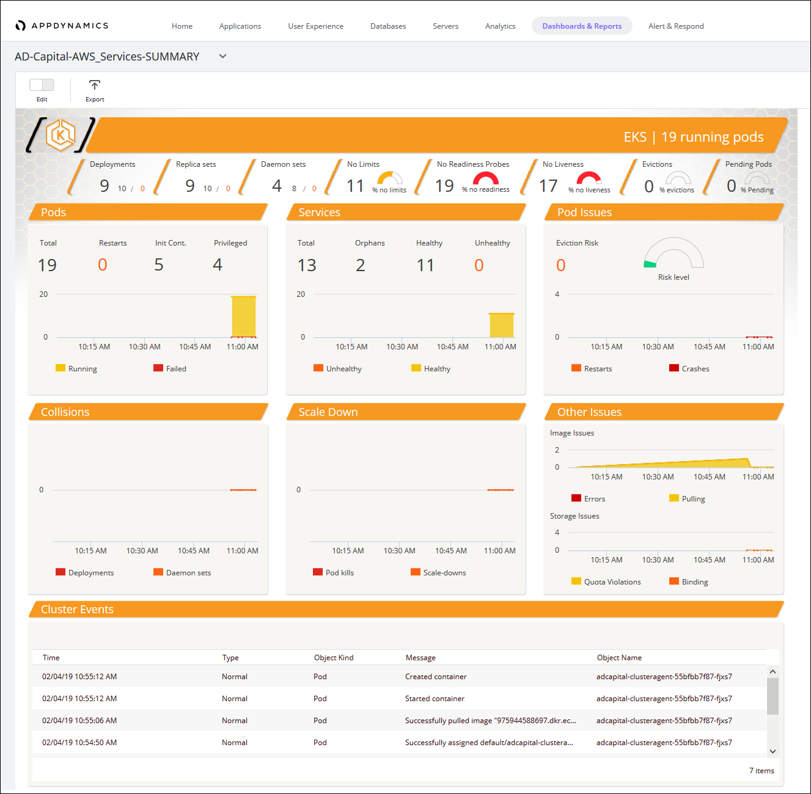
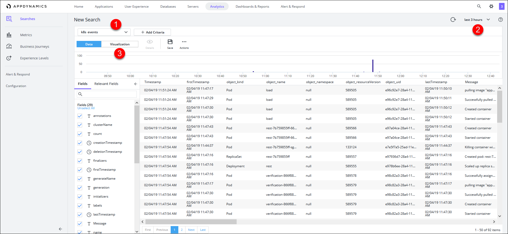
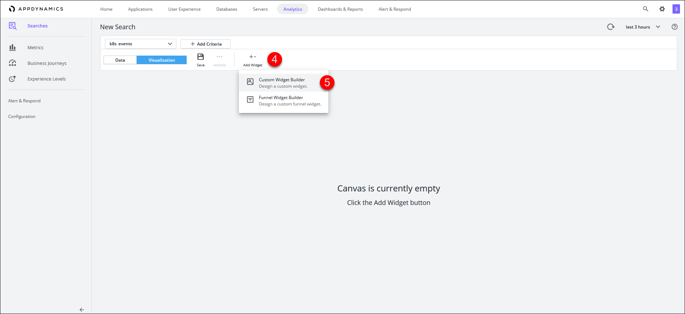
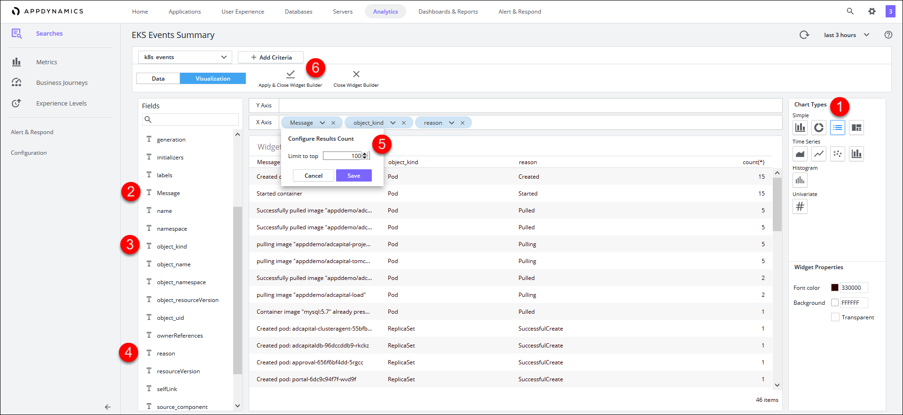
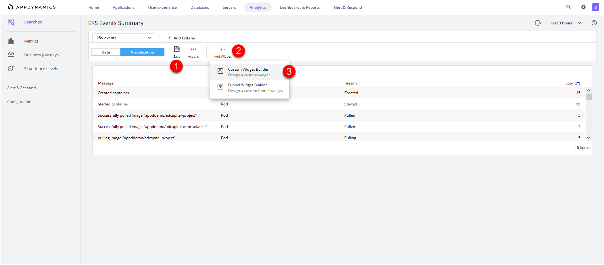

# Lab Exercise 6
## Deploy the Kubernetes Extension to EKS


In this exercise you will need to do the following:

- Deploy the Kubernetes Extension to the EKS cluster
- Monitor the results of deploying the Kubernetes Extension
- Create a new custom dashboard for Kubernetes events

<br>

### **1.** Deploy the Kubernetes Extension to EKS

Using the SSH terminal for the Launch Pad EC2 instance, change to the directory to deploy the Kubernetes Extension by running the command below:

```
cd /home/ec2-user/AppD-Cloud-Kickstart/applications/aws/AD-Capital-Kube/KubeExtMachineAgent
```

<br>

Depending on what AWS region you deployed the AD-Capital application to in the previous exercise, **run only one of the following commands** below:

If you are working in the **us-east-1** region, run the command below:
```
kubectl create -f us-east-1/
```

If you are working in the **us-east-2** region, run the command below:
```
kubectl create -f us-east-2/
```

If you are working in the **us-west-1** region, run the command below:
```
kubectl create -f us-west-1/
```

If you are working in the **us-west-2** region, run the command below:
```
kubectl create -f us-west-2/
```

<br>

You should see output from the command similar to the image seen below:


<br>

### **2.** Monitor the Results of Deploying the Kubernetes Extension to EKS

Now wait two minutes and run the command below to validate that the extension has been deployed to the cluster:

```
kubectl get pods -n default
```
You should then see output similar to the image seen below:



<br>

After 12 minutes, you will see a new dashboard created like the image seen below.  You can find it by navigating to the Dashboards & Reports tab at the top menu in the AppDynamics UI:



<br>

### **3.** Create a Custom Dashboard for Kubernetes Extension

In the AppDynamics UI, create a new Analytics search by doing the following steps:

1. Navigate to the Analytics tab on the top menu
2. Click on the Searches tab on the left menu
3. Click on the Add button and
4. Choose the Drag and Drop Search option


<br>

Follow the steps below to see the Kubernetes events:

1. Choose the k8s events in the drop down on the left
2. Choose the Last 3 Hours in the time slector on the top right
3. Click on the Visualization button
4. Click the Add Widget button
5. Choose the Custom Widget Builder option 





<br>

Next, follow the steps below to see create the first widget:

1. Choose the Table widget under chart types on the top right
2. Click on the Message field in the fields list and drag it to the X Axis
3. Click on the object_kind field in the fields list and drag it to the X Axis
4. Click on the reason field in the fields list and drag it to the X Axis
5. Click the down arrow in the Message field and change the top limit to 100, for object_kind and reason, change the top limit to 20
6. Click on the Apply & Close Widget Builder button 



<br>

Follow the steps below to save the dashboard and create the second widget:

1. Click on the Save button and name the dashboard 'EKS Events Summary'
2. Click the Add Widget button
3. Choose the Custom Widget Builder option



<br>

Now follow the steps below to save the dashboard and create the second widget:

1. Choose the Column widget under chart types on the top right
2. Click on the object_kind field in the fields list and drag it to the X Axis
3. Click on the reason field in the fields list and drag it to the X Axis
4. Click the down arrow in the object_kind field and change the top limit to 20 and do the same for reason field
5. Click on the Apply & Close Widget Builder button 


You should now have a finished dashboard that looks like the one seen below:


<br>

[Overview](aws-eks-monitoring.md) | [1](lab-exercise-01.md), [2](lab-exercise-02.md), [3](lab-exercise-03.md), [4](lab-exercise-04.md), [5](lab-exercise-05.md), 6 | [Back](lab-exercise-05.md) | Next
