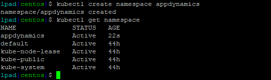
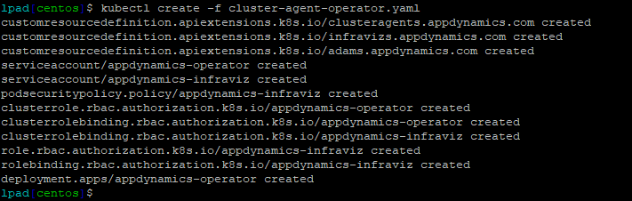
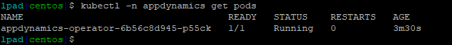
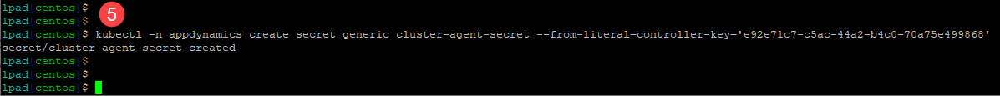
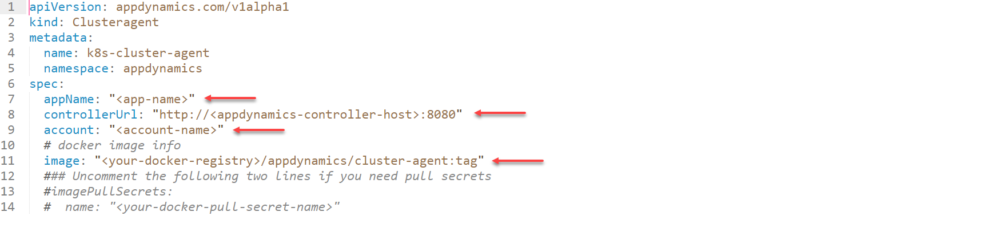
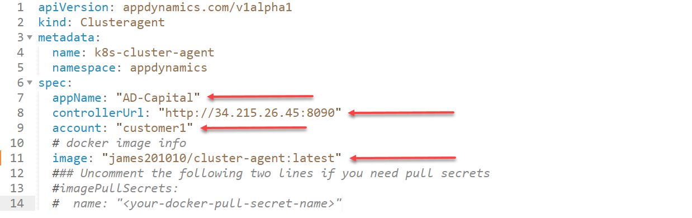
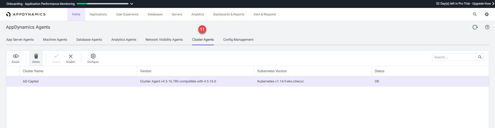
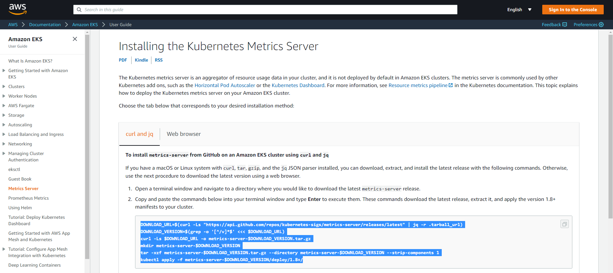
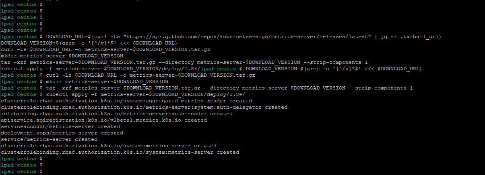
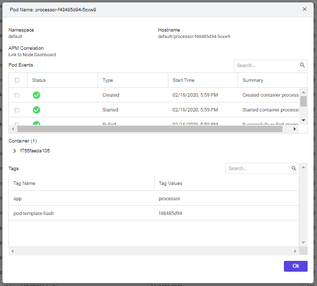

# Lab Exercise 6
## Deploy the Cluster Agent to EKS


In this exercise you will need to do the following:

- Deploy the Cluster Agent Operator to the EKS cluster
- Build the Cluster Agent Docker image
- Configure and Deploy the Cluster Agent
- Install the Kubernetes Metric Server
- Monitor the results of deploying the Cluster Agent

<br>

### **1.** Deploy the Cluster Agent Operator to the EKS cluster

Using the SSH terminal for the Launch Pad EC2 instance, change to the directory to unzip the Cluster Agent Zip file:

```
cd /home/centos/AppD-Cloud-Kickstart/applications/aws/AD-Capital-Kube/ClusterAgent
```

Now use the command below to unzip the Cluster Agent Zip file:

```
unzip appdynamics-cluster-agent-ubuntu.zip
```


You should see output from the command similar to the image seen below:


<br>

Use the command below to create the namespace for the Cluster Agent Operator:

```
kubectl create namespace appdynamics
```

Use the next command below to verify the appdynamics namespace was created:

```
kubectl get namespace
```

You should see output from the command similar to the image seen below:



<br>

Use the command below to deploy the Cluster Agent Operator to the EKS cluster:

```
kubectl create -f cluster-agent-operator.yaml
```
You should see output from the command similar to the image seen below:



<br>

Use the next command below to verify the Cluster Agent Operator was deployed and is now running:

```
kubectl -n appdynamics get pods
```

You should see output from the command similar to the image seen below:



<br>

### **2.** Build the Cluster Agent Docker image

Use your [AWS Management Console](https://aws.amazon.com/console/) and follow the steps below to create a Docker repository in AWS ECR within your region:

1. Click on the "Services" link at the top left of the console
2. Type in "ECR" into the search box
3. Click on the first entry named "ECR"


<br><br>

4. Click on "Repositories" on the left
5. Click on the "Create repository" button on the top right


<br><br>

6. Enter the name of your repository as seen in the image below and use your specific lab user number where the red arrow is pointing to, so you **ensure that your repository name is unique**.  For example, if your lab user name is "Lab-User-01" then your repository name would be "lab-user-01/cluster-agent"
7. Click on the "Create repository" button on the bottom right


<br><br>

8. Now click on the "View push commands" button on the top right 


<br><br>

9. Highlight the login command as seen in the image below, then copy and paste it into your SSH terminal window 


<br><br>

10. Once you have pasted the command into the terminal window and executed the command, you should see a large block of text that you need to highlight and copy as seen in the image below where the block of text has been highlighted in grey 


<br><br>

11. Now paste the large login command into the terminal window and execute the command. You should see the "Login Succeeded" as the final output of the command


<br><br>

12. Use the command below to change to the docker directory in your SSH terminal window

```
cd /home/centos/AppD-Cloud-Kickstart/applications/aws/AD-Capital-Kube/ClusterAgent/docker
```


<br><br>

13. Copy the docker build command highlighted in the image below and paste it into your SSH terminal window and execute the command


<br><br>


14. Once you have copied the docker build command into your SSH terminal window and executed it, you should see output like the image below.


<br><br>


15. Copy the docker tag command highlighted in the image below and paste it into your SSH terminal window and execute the command.


<br><br>


16. Once you have copied the docker tag command into your SSH terminal window and executed it, you can then execute the ``` docker images ``` command and should see output like the image below.


<br><br>


17. Copy the docker push command highlighted in the image below and paste it into your SSH terminal window and execute the command.


<br><br>

18. Once you have copied the docker push command into your SSH terminal window and executed it, you should see output like the image below.


<br><br>

19. Now drill into your Docker repository in the AWS Console, you should see your newly published image inside your repo.  Copy the Image URI of your new image and save it in a text file to use in the next section of the lab.


<br><br>

<br>

### **3.** Configure and Deploy the Cluster Agent

In the AppDynamics UI, find and copy your controller access key using the following steps:

1. Click on the gear icon in the top right of the controller UI
2. Select the "License" option from the dropdown menu


<br><br>

3. Click on the "Account" tab
4. Then click on the "Show" link to the right of the Access Key to reveal the Access Key value, then highlight and copy your Access Key into a text file


<br><br>

5. Now execute the command below in your SSH terminal window using your controller access key you obtained in the last step.

```
kubectl -n appdynamics create secret generic cluster-agent-secret --from-literal=controller-key='<your-controller-access-key>'
```


```
Example:

kubectl -n appdynamics create secret generic cluster-agent-secret --from-literal=controller-key='e92e71c7-c5ac-44a2-b4c0-70a75e499868'
```

You should see output from the command like the image below:

<br><br>

6. Now use the command below to change to the directory where you will edit the "cluster-agent.yaml" file.

```
cd /home/centos/AppD-Cloud-Kickstart/applications/aws/AD-Capital-Kube/ClusterAgent
```
<br>

7. Now edit the "cluster-agent.yaml" file with the editor of your choice and replace the values in lines 7, 8, 9, and 11.

BEFORE:


<br><br>

Line 7 should = "AD-Capital"<br>
Line 8 should = The URL for your controller including the protocol and port (surrounded in double quotes)<br>
Line 9 should = "customer1"<br>
Line 11 should = The Image URI of your docker image created in this lab (Section 2.19) - (surrounded in double quotes)

<br><br>

AFTER EXAMPLE:

<br><br>

8. Now execute the commands below to deploy the Cluster Agent.  After executing the commands you should see the output like the image below.

```
cd /home/centos/AppD-Cloud-Kickstart/applications/aws/AD-Capital-Kube/ClusterAgent

kubectl create -f cluster-agent.yaml
```

<br><br>

In the AppDynamics UI, validate that the Cluster Agent is now installed with the following steps.

9. Click on the gear icon in the top right of the controller UI
10. Select the "AppDynamics Agents" option from the dropdown menu


<br><br>

11. Click on the "Cluster Agents" tab and you should see the "AD-Capital" cluster agent like the image below.


<br><br>

12. From here you can also click on the "Configure" button on the toolbar to add additional namespaces to be monitored by the Cluster Agent by moving them from the right list box to the left list box.


<br><br>

### **4.** Install the Kubernetes Metric Server

Use your web browser to naviate to the URL below:

```
https://docs.aws.amazon.com/eks/latest/userguide/metrics-server.html
```

Follow the instructions to install the Kubernetes Metric Server.  Copy the command seen highlighted in the image below and execute the command in your SSH terminal window.


<br><br>

After executing the command in your SSH terminal window, you should see output like the image below.


<br><br>

### **5.** Monitor the results of deploying the Cluster Agent

In the AppDynamics UI, monitor the results of deploying the Cluster Agent by navigating to the "Servers" tab, then click on the "Clusters" tab on the left, then double click on the "AD-Capital" cluster.


<br><br>

On the Cluster Dashboard Tab you can see a high level view of the state of all the pods in the cluster.  Explore the data found here on this screen and look at the corresponding documentation for this screen here:

```
https://docs.appdynamics.com/display/PRO45/Monitor+Cluster+Health#MonitorClusterHealth-DashboardTab
```

<br><br>

On the Pods Dashboard Tab you can see all the pods in various states and as well as a high-level summary of each pod.  Explore the data found here on this screen and look at the corresponding documentation for this screen here:

```
https://docs.appdynamics.com/display/PRO45/Monitor+Cluster+Health#MonitorClusterHealth-PodsTab
```

<br><br>

On the Pods Dashboard Details screen you can see all the details for a given pod as well as information about the containers running in the pod.  Explore the data found here on this screen and look at the corresponding documentation for this screen here:

```
https://docs.appdynamics.com/display/PRO45/Monitor+Cluster+Health#MonitorClusterHealth-PodDetailsScreen
```

<br><br>


On the Inventory Dashboard Tab you can see a high-level snapshot or inventory view of your cluster. It displays the contents of the cluster and allows users to troubleshoot applications running in the cluster.  Explore the data found here on this screen and look at the corresponding documentation for this screen here:

```
https://docs.appdynamics.com/display/PRO45/Monitor+Cluster+Health#MonitorClusterHealth-InventoryTab
```

<br><br>

## Congratulations! You have finished the AWS EKS Monitoring Lab.
<br>

[Overview](aws-eks-monitoring.md) | [1](lab-exercise-01.md), [2](lab-exercise-02.md), [3](lab-exercise-03.md), [4](lab-exercise-04.md), [5](lab-exercise-05.md), 6 | [Back](lab-exercise-05.md) | Next
