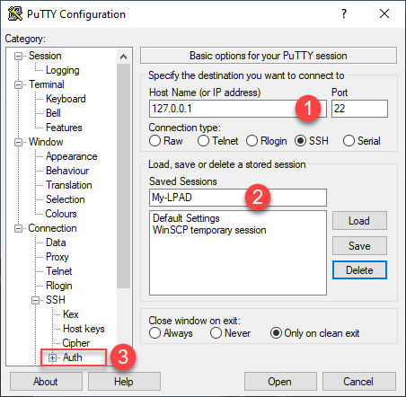

# Lab Exercise 1
## Clone GitHub Repository & Retrieve AKS Kubernetes Cluster Configuration 

This workshop takes previously configured docker-compose applications (AD-Capital-Kube) and makes them deployable to a Kubernetes cluster. If you are curious about any of the repositiories; either the original java application code itself or the dockerized version, they are publicly available with detailed explanations as to what they contain. For the purpose of this walkthrough, it will be focused solely on Kubernetes.

In this exercise you will need to do the following:

- SSH into the Launch Pad VM instance
- Clone GitHub repository
- Run commands to connect to a AKS Kubernetes cluster

<br>

### **1.** SSH Into the Launch Pad VM Instance
You will need a copy of the `AppD-Cloud-Kickstart.pem` file in order to SSH into your Launch Pad VM instance. You can obtain a copy of the `AppD-Cloud-Kickstart.pem` file from your lab instructor.  

You will use the user name '**centos**' with no password to SSH into the Launch Pad VM instance.
<br><br>

***For Mac Users:***

Run the command below from a terminal window, with the path to your copy of the `AppD-Cloud-Kickstart.pem` file and the IP Address of your Launch Pad VM instance:
```bash
chmod 400 <path-to-file>/AppD-Cloud-Kickstart.pem
ssh -i <path-to-file>/AppD-Cloud-Kickstart.pem centos@<ip-address-of-your-launch-pad-gce-instance>
```

Example:
```bash
ssh -i AppD-Cloud-Kickstart.pem centos@35.206.71.70
```

<br>

***For Windows Users:***

You will need [PuTTY](https://www.putty.org/) or another SSH client installed to SSH into the Launch Pad VM instance.
<br>

If you are using PuTTY, you can obtain a copy of the `AppD-Cloud-Kickstart.ppk` file from your lab instructor.

Configure PuTTY to SSH into the Launch Pad VM instance using the steps below:

1. Enter the public IP address of your LPAD instance
2. Enter a name for your session to your LPAD instance
3. Click on the Auth option under SSH
4. Click on the Browse button to select your PPK file
5. Click on the Session option at the top of the tree on the left
6. Click on the Save button and your session will be added to the list
7. Click on the Open button to start your session





When your session opens you will be prompted for your user name. Enter '**centos**' for the user name, no password is required.


<br>

### **2.** Clone GitHub Repository

Once you have an SSH command terminal open to the VM instance for the launch pad, you need to clone the GitHub repository by running the commands below:

```bash
cd ~

git clone https://github.com/CiscoDevNet/AppD-Cloud-Kickstart.git
```

After you run the command, you should have this folder in your home directory.

*~/AppD-Cloud-Kickstart*


<br>

### **3.** Connect to the AKS Kubernetes Cluster

The Azure command-line interface (Azure CLI) is a set of commands used to create and manage Azure 
resources. The Azure CLI is available across Azure services and is designed to get you working quickly 
with Azure, with an emphasis on automation.

Verify your Azure CLI configuration:

```bash
az account show
```

After you run the command, verify that the **name** property begins with '**AppDynamics Channel Workshop**':


<br>

Next, verify the name of your AKS cluster and the Resource Group:

```bash
echo $azurerm_aks_cluster_name

echo $azurerm_resource_group
```

After you run the command, take note of your **AKS cluster name** and **Resource Group**:


<br>

Finally, update the local kubeconfig file with appropriate credentials and endpoint information for your AKS cluster. By default, 
the credentials are written to `$HOME/.kube/config`. You can provide an alternate path by setting the `KUBECONFIG` environment variable.

Fetch the credentials for your AKS cluster, making sure to validate the environment variables referenced in the previous step.  

Then, validate the configuration by displaying a list of cluster services:

```bash
az aks get-credentials --admin --name $azurerm_aks_cluster_name --resource-group $azurerm_resource_group

kubectl get services
```

Check to see if the output from the command is similar to the image seen below:


[Overview](azure-aks-monitoring.md) | 1, [2](lab-exercise-02.md), [3](lab-exercise-03.md), [4](lab-exercise-04.md), [5](lab-exercise-05.md) | [Back](azure-aks-monitoring.md) | [Next](lab-exercise-02.md)
