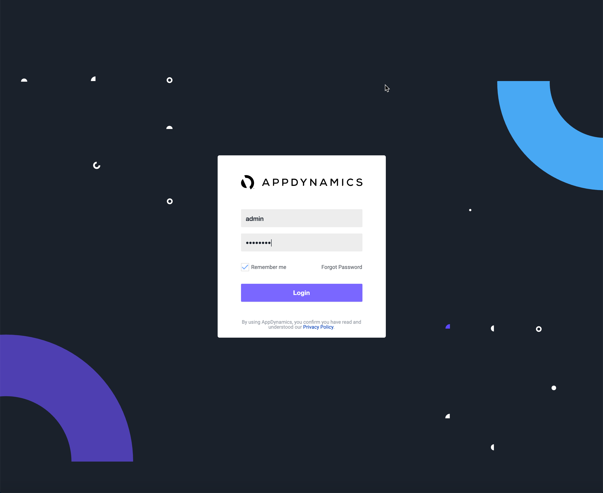
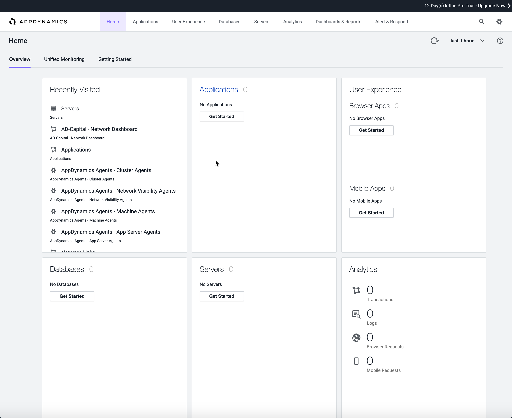

# Lab Exercise 2
## Verify Access to the Controller Azure VM Instance

The AppDynamics Controller is the central management server where all data is stored and analyzed. 
All AppDynamics Agents connect to the Controller to report data, and the Controller provides a 
browser-based user interface for monitoring and troubleshooting application performance. In addition 
to the AppDynamics Controller, the VM instance also includes the AppDynamics Enterprise Console and 
Events Service applications running on it.  

In this exercise you will need to do the following:

- Login to the AppDynamics Controller Console
- Run a command to validate the Controller status

<br>

### **1.** Login to the AppDynamics Controller Console

Your lab instructor will provide you with the public IP address of your Controller.  

To access the Controller console, open your browser and enter the following URL:

```http
http://<controller_ip_address_here>:8090/controller
```

Use the username "**admin**" to login.  
Enter "**welcome1**" as the password.



<br>

After logging in, you will be taken to the **Home** page:



<br>

### **2.** Run a Command to Validate the Controller Status

The AppDynamics APM Platform exposes various APIs for customizing and extending its features on the 
platform-side, which are served by the Controller and Events Service; as well as on the agent-side.  

The AppDynamics platform server components and agents offer the following APIs:

- **Controller APIs**: Administer the Controller, configure, monitor, query metrics, and more.
- **Accounts APIs**: Manage and monitor accounts, users, and other aspects of AppDynamics licensing.

For additional documentation, see the [Platform API Index](https://docs.appdynamics.com/latest/en/extend-appdynamics/appdynamics-apis#AppDynamicsAPIs-apiindex).  

<br>

Let's try a simple REST API command to validate the Controller status.  

Using your **LPAD instance**, run the following `curl` command:

```bash
curl -s http://<controller_ip_address_here>:8090/controller/rest/serverstatus
```

If the Controller has successfully started, an XML document such as the following will be returned:
```bash
<?xml version="1.0" encoding="UTF-8"?>
<serverstatus vendorid="" version="1">
  <available>true</available>
  <serverid></serverid>
  <serverinfo>
    <vendorname>AppDynamics</vendorname>
    <productname>AppDynamics Application Performance Management</productname>
    <serverversion>021-004-014-000</serverversion>
    <implementationVersion>Controller v21.4.14.0 Build 21.4.14-1533 Commit 2ddf842f4d502413b837090895df79e01b8a29ce</implementationVersion>
  </serverinfo>
  <startupTimeInSeconds>5</startupTimeInSeconds>
</serverstatus>
```

[Overview](azure-aks-monitoring.md) | [1](lab-exercise-01.md), 2, [3](lab-exercise-03.md), [4](lab-exercise-04.md), [5](lab-exercise-05.md) | [Back](lab-exercise-01.md) | [Next](lab-exercise-03.md)
