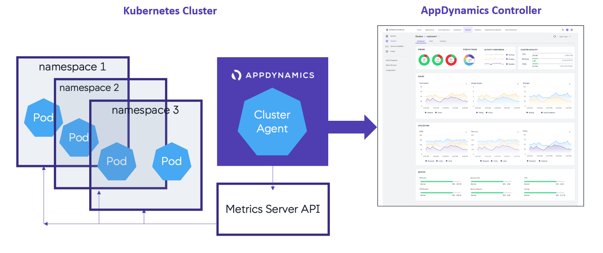
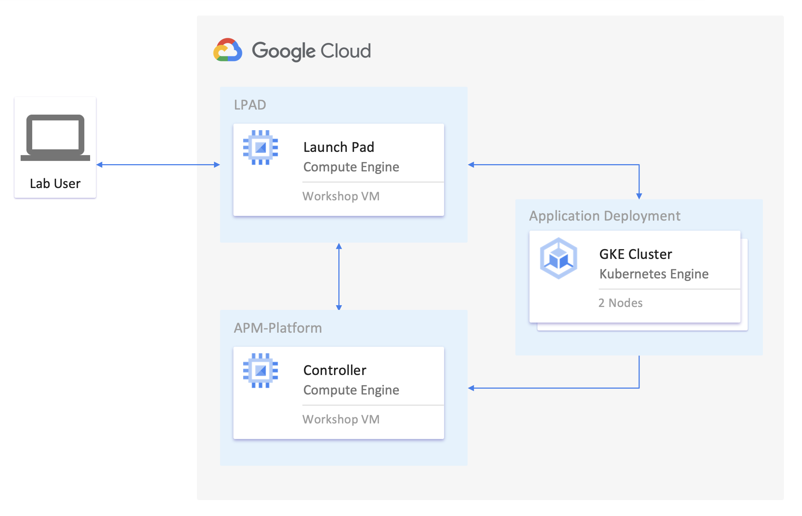

## Overview

Google Kubernetes Engine (GKE) provides a managed environment for deploying, managing, and scaling your 
containerized applications using Google infrastructure. The GKE environment consists of multiple machines 
(specifically, Compute Engine instances) grouped together to form a cluster. For modern containerized 
platforms like GKE, performance monitoring is critically important.  

AppDynamics seamlessly integrates into GKE environments, providing insights into the performance of every 
microservice deployed; along with container and k8s visibility; all through a single pane of glass. AppDynamics 
provides enterprise-grade, end-to-end performance monitoring for applications orchestrated by Kubernetes.

## Monitoring Google GKE with AppDynamics

GKE makes it easier to operate Kubernetes clusters; however, performance monitoring remains one of the top 
challenges in Kubernetes adoption. In fact, according to a recent CNCF survey, 46% of enterprises reported 
monitoring as their biggest challenge. Specifically, organizations deploying containers on the public cloud, 
cite monitoring as a big challenge. Perhaps because cloud providers monitoring tools may not play well with 
organization’s existing tools which are used to monitor on-premises resources.

## How Does it Work?

AppDynamics seamlessly integrates into GKE environments. The AppDynamics Cluster Agent enables CloudOps team 
to get deep level visibility into EKS clusters, including every node, pod, and namespace down to the 
container level. The Cluster Agent utilizes the existing Kubernetes Metrics Server API to bring back key 
performance data at the cluster, namespace, and node level. The agent displays metrics on Events, Pods, 
Deployments, Daemon-sets, Jobs, Services, Service Endpoints, Quotas, Configs, Containers, and Resource 
Limits.

In addition, the machine agent runs as a DaemonSet on GKE worker nodes, and application agents are deployed 
alongside your application binaries within the application pods. Out-of-the-box integration gives you the 
deepest visibility into GKE cluster health, GCP resources and Docker containers, and provides insights into 
the performance of every microservice deployed—all through a single pane of glass.

## Workshop Overview

We have created a multi-service application containerized with Docker that is ready to deploy to GCP using 
GKE. As part of the workshop, you will deploy the application on GKE and walkthrough the steps to establish 
full stack monitoring for the application.

  

## Lab Exercises

| Lab Exercise | Description                                                             | Estimated Time |
| :----------: | :---------------------------------------------------------------------- | :------------: |
|      1       | Clone GitHub Repository & Retrieve GKE Kubernetes Cluster Configuration |   15 minutes   |
|      2       | Verify Access to the Controller GCE Instance                            |   15 minutes   |
|      3       | Deploy AD-Capital Application to the GKE Kubernetes Cluster             |   30 minutes   |
|      4       | Deploy the Server Agent & Network Agent to GKE                          |   20 minutes   |
|      5       | Deploy the Cluster Agent to GKE                                         |   40 minutes   |

  

To ease the effort, we have created a couple of Google Compute Engine Images using automated tooling. The 
following diagram explains the workflow of the labs and how participants will interact:

1. [Clone GitHub Repository & Retrieve GKE Kubernetes Cluster Configuration](lab-exercise-01.md)
   - In this step you will use the Launch Pad GCE instance to clone a Github repository and retrieve your Kubernetes cluster configuration from GCP GKE.  
2. [Verify Access to the Controller GCE Instance](lab-exercise-02.md)
   - In this step you will use a browser to login to the AppDynamics Controller console as well as run a REST command to validate the Controller status from the command-line.  
3. [Deploy AD-Capital Application to the GKE Kubernetes Cluster](lab-exercise-03.md)
   - In this step you will use the Launch Pad GCE instance to deploy the AD-Capital application to the GKE cluster and monitor the results of the deployment in the AppDynamics Controller.  
4. [Deploy the Server Agent & Network Agent to GKE](lab-exercise-04.md)
   - In this step you will use the Launch Pad GCE instance to deploy the Server Agent and Network Agent to the GKE cluster and monitor the results of the deployment in the AppDynamics Controller.  
5. [Deploy the Cluster Agent to GKE](lab-exercise-05.md)
    - In this step you will use the Launch Pad GCE instance to deploy the AppDynamics Kubernetes Cluster Agent to the GKE cluster and monitor the results of the deployment in the AppDynamics Controller.  
 

Overview | [1](lab-exercise-01.md), [2](lab-exercise-02.md), [3](lab-exercise-03.md), [4](lab-exercise-04.md), [5](lab-exercise-05.md) | Back | [Next](lab-exercise-01.md)
