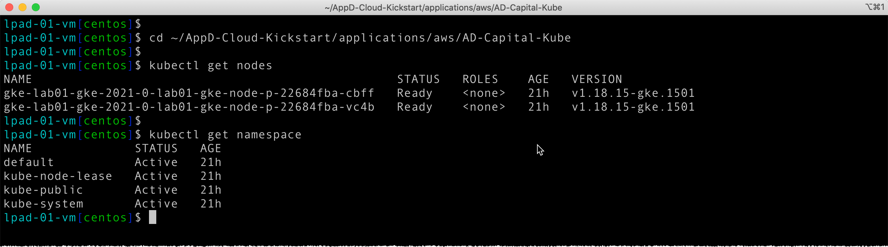
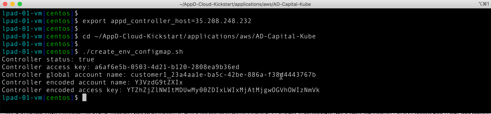
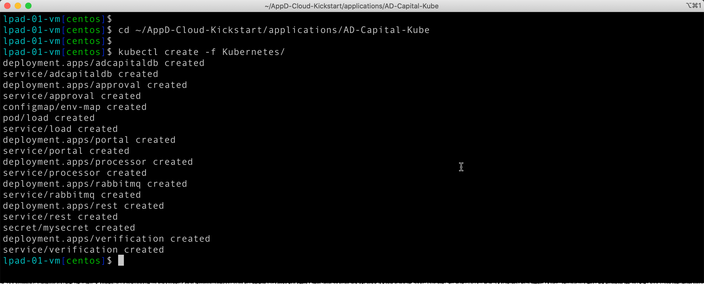
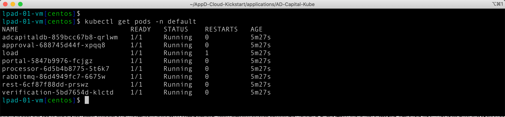
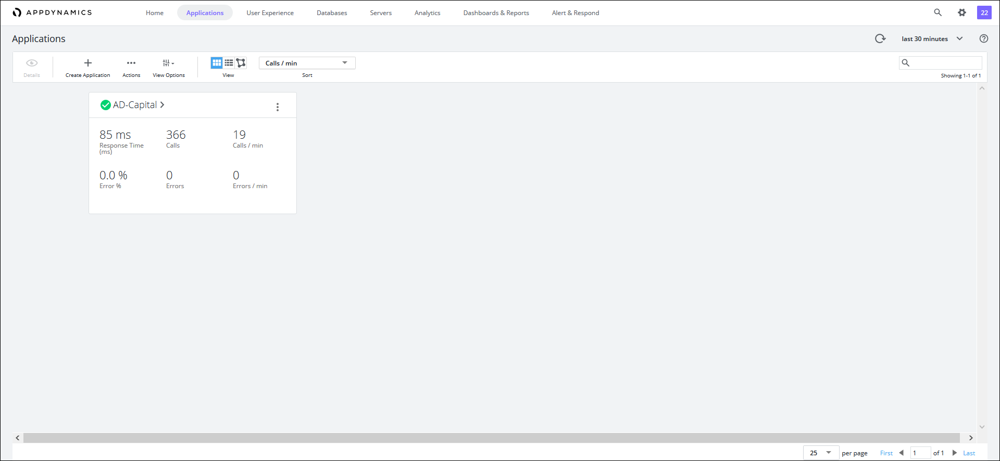
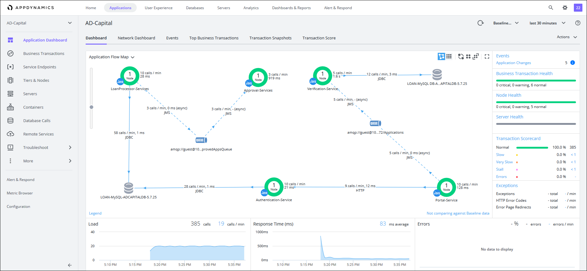

# Lab Exercise 3
## Deploy AD-Capital Application to the GKE Kubernetes Cluster

In this exercise you will need to do the following:

- SSH into the Launch Pad GCE instance
- Explore GKE cluster environment with the 'kubectl' Kubernetes CLI
- Run a script to set environment variables for GKE deployment
- Run a script to deploy the AD-Capital application to GKE
- Monitor the results of the deployment in the AppDynamics Controller

<br>

### **1.** SSH Into the Launch Pad GCE Instance

SSH into the Launch Pad GCE instance. You will use the user name '**centos**' with no password.

```bash
ssh -i <path-to-file>/AppD-Cloud-Kickstart.pem centos@<ip-address-of-your-launch-pad-gce-instance>
```

Example:
```bash
ssh -i AppD-Cloud-Kickstart.pem centos@35.206.71.70
```

<br>

### **2.** Explore GKE Cluster Environment with the 'kubectl' Kubernetes CLI

The Kubernetes command-line tool, `kubectl`, allows you to run commands against Kubernetes clusters. 
You can use kubectl to deploy applications, inspect and manage cluster resources, and view logs. 
For more information including a complete list of kubectl operations, see the 
[kubectl reference documentation](https://kubernetes.io/docs/reference/kubectl/).  

Run the commands below to view the nodes and namespaces within your GKE cluster:

```bash
cd ~/AppD-Cloud-Kickstart/applications/aws/AD-Capital-Kube

kubectl get nodes

kubectl get namespace
```
You should see output from the commands similar to the image seen below:



<br>

### **3.** Set Environment Variables for GKE Deployment

Run the command below to set the environment variable for the AppDynamics Controller host, replacing 
'**your-controller-ip-address**' with the public IP address of your Controller:

```bash
export appd_controller_host=your-controller-ip-address
```
Run the commands below to complete the process of setting all the variables needed to deploy to the GKE cluster:

```bash
cd ~/AppD-Cloud-Kickstart/applications/aws/AD-Capital-Kube

./create_env_configmap.sh
```
You should then see output similar to the image seen below:



<br>

### **4.** Deploy the AD-Capital Application to GKE

To deploy the AD-Capital application to the GKE cluster, run the commands below:

```bash
cd ~/AppD-Cloud-Kickstart/applications/AD-Capital-Kube

kubectl create -f Kubernetes/
```
You should then see output similar to the image seen below:



Now wait four minutes and run the command below to validate that the GKE pods are running:

```bash
kubectl get pods -n default
```
You should then see output similar to the image seen below:



<br>

### **5.** Monitor Deployment in the AppDynamics Controller

Wait four more minutes and go to your web browser and check the controller to see if the AD-Capital application is reporting to the controller. You should see what the image below shows when you click on the Applications tab:



Wait a few more minutes and you should see the flow map that looks like the image below:



<br>

**NOTE:** If your application does not show up in AppD, there was likely an issue with the Public IP 
passed along or with the config map. You may need to delete your deployment and recreate after verifying 
those steps. After deleting the application deployment, go back to step 4. The command to delete your 
deployment is: `kubectl delete -f Kubernetes/`

<br>

[Overview](gcp-gke-monitoring.md) | [1](lab-exercise-01.md), [2](lab-exercise-02.md), 3, [4](lab-exercise-04.md), [5](lab-exercise-05.md) | [Back](lab-exercise-02.md) | [Next](lab-exercise-04.md)
