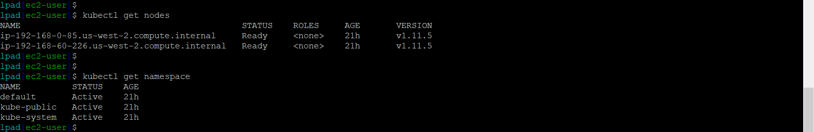
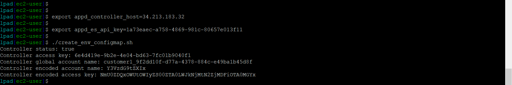
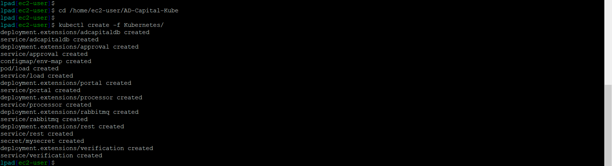
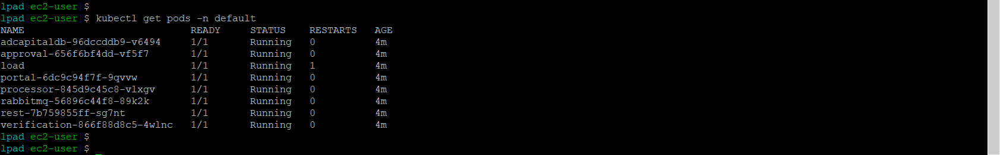

# Lab Exercise 3
## Deploy AD-Capital Application to EKS on the LaunchPad Server


In this exercise you will need to do the following:

- Connect to your LaunchPad Server via SSH
- Validate that your EKS cluster has deployed properly
- Run a script to set environment variables for EKS deployment
- Run a script to deploy the AD-Capital application to EKS
- Monitor the results of the deployment in the AppDynamics Controller

<br>

### **1.** Validate Your EKS Cluster
ssh into the launchpad Server

```bash
ssh -i AppD-Cloud-Kickstart.pem ec2-user@FQDN_OF_MACHINE
```

Using the SSH terminal for the Launch Pad EC2 instance, run the commands below to validate your EKS cluster creation is complete and running:

```bash
cd ~/AppD-Cloud-Kickstart/applications/aws/AD-Capital-Kube

kubectl get nodes

kubectl get namespace
```
You should see output from the commands similar to the image seen below:



<br>


### **2.** Set Environment Variables for EKS Deployment
Run the command below to set the variable for the controller host, replacing 'your-controller-host-name-or-ip' with the public IP address or public host name of your controller:

```bash
export appd_controller_host=your-controller-host-name-or-ip
```
**NOTE:** Before you proceed to the next step, confirm that your controller has finished starting up by logging into your controller with your browser.  If you run the next command before your controller has completely initialized, you will get an error.  If this happens, wait until you can login to your controller and run the command again.

Run the commands below to complete the process of setting all the variables needed to deploy to the EKS cluster:

```bash
cd ~/AppD-Cloud-Kickstart/applications/aws/AD-Capital-Kube

./create_env_configmap.sh
```
You should then see output similar to the image seen below:



<br>

### **3.** Deploy the AD-Capital Application to EKS

To deploy the AD-Capital application to the EKS cluster, run the commands below:

```bash
cd ~/AppD-Cloud-Kickstart/applications/AD-Capital-Kube

kubectl create -f Kubernetes/
```
You should then see output similar to the image seen below:



Now wait four minutes and run the command below to validate that the EKS pods are running:

```bash
kubectl get pods -n default
```
You should then see output similar to the image seen below:




<br>

### **4.** Monitor Deployment in the AppDynamics Controller

Wait four more minutes and go to your web browser and check the controller to see if the AD-Capital application is reporting to the controller. You should see what the image below shows when you click on the Applications tab:


Wait a few more minutes and you should see the flow map that looks like the image below:


<br>

**NOTE:** If your application does not show up in AppD, there was likely an issue with the Public IP / FQDN passed along or the config map. You may need to delete your deployment and recreate after verifying those steps. After deleting the application deployment, go back to step 5. The command to delete your deployment is: `kubectl delete -f Kubernetes/`

<br>

[Overview](gcp-gke-monitoring.md) | [1](lab-exercise-01.md), [2](lab-exercise-02.md), 3, [4](lab-exercise-04.md), [5](lab-exercise-05.md) | [Back](lab-exercise-02.md) | [Next](lab-exercise-04.md)
