# Lab Exercise 5
## Deploy the Cluster Agent to EKS


In this exercise you will need to do the following:

- Deploy the Cluster Agent Operator to the EKS cluster
- Build the Cluster Agent Docker image
- Configure and Deploy the Cluster Agent
- Install the Kubernetes Metric Server
- Monitor the results of deploying the Cluster Agent

<br>

### **1.** Deploy the Cluster Agent Operator to the EKS cluster

Using the SSH terminal for the Launch Pad EC2 instance, change to the directory to unzip the Cluster Agent Zip file:

```bash
cd ~/AppD-Cloud-Kickstart/applications/aws/AD-Capital-Kube/ClusterAgent
```

Now use the command below to unzip the Cluster Agent Zip file:

```bash
unzip appdynamics-cluster-agent-alpine-linux.zip
```


You should see output from the command similar to the image seen below:

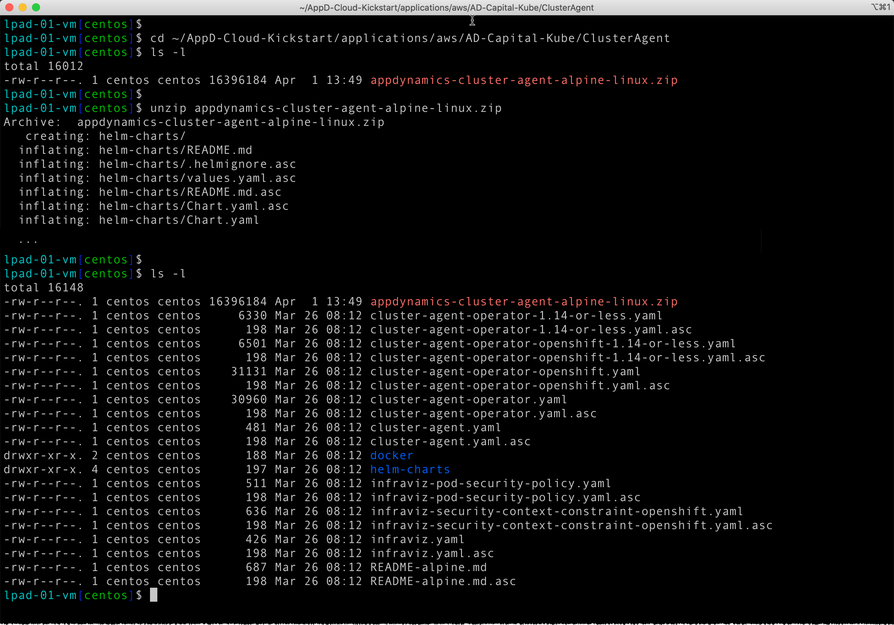

<br>

Use the command below to create the namespace for the Cluster Agent Operator:

```bash
kubectl create namespace appdynamics
```

Use the next command below to verify the appdynamics namespace was created:

```bash
kubectl get namespace
```

You should see output from the command similar to the image seen below:

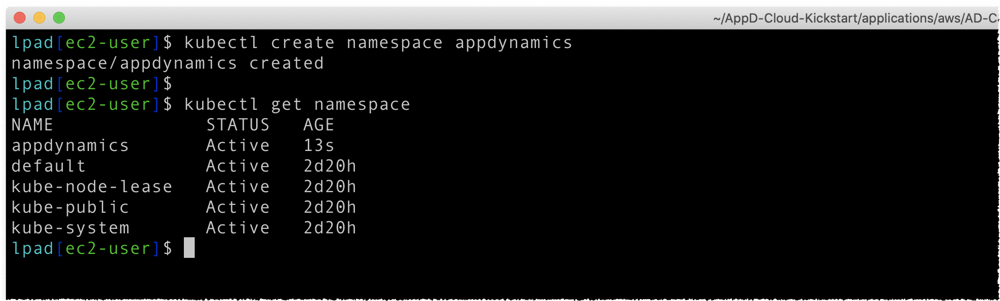

<br>

Use the command below to deploy the Cluster Agent Operator to the EKS cluster:

```bash
kubectl create -f cluster-agent-operator.yaml
```
You should see output from the command similar to the image seen below:

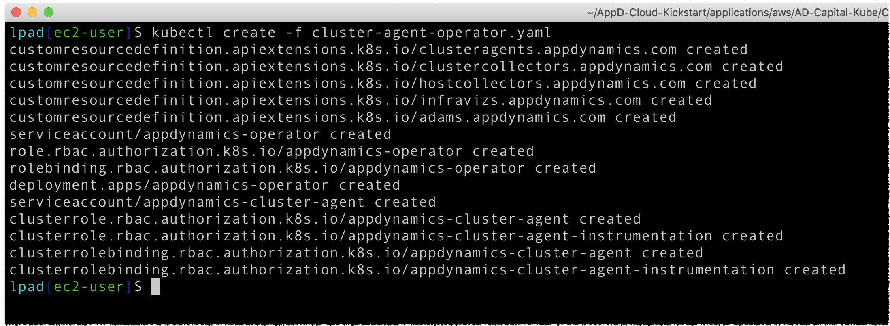

<br>

Use the next command below to verify the Cluster Agent Operator was deployed and is now running:

```bash
kubectl -n appdynamics get pods
```

You should see output from the command similar to the image seen below:

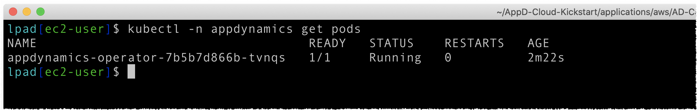

<br>

### **2.** Build the Cluster Agent Docker image

For the purposes of this lab we will use a pre-built Cluster Agent Docker image with the following Image URI: 

```bash
edbarberis/cluster-agent:latest
```

However, if you were deploying the Cluster Agent in your own Kubernetes cluster, you would need to build your own Cluster Agent Docker image in your own Docker repository.  Instructions for building your own Cluster Agent Docker image in AWS ECR can be found [here](lab-exercise-06-b.md) and are included for reference only. You do not have do the steps in that link to complete this lab.

<br>

### **3.** Configure and Deploy the Cluster Agent

In the AppDynamics UI, find and copy your controller access key using the following steps:

1. Click on the gear icon in the top right of the controller UI
2. Select the "License" option from the dropdown menu

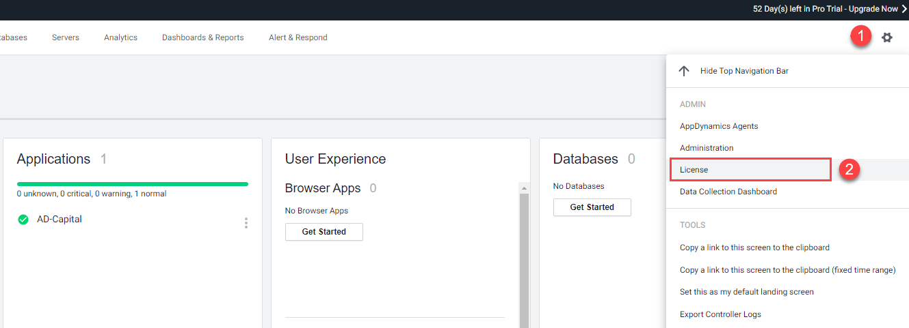
<br><br>

3. Click on the "Account" tab
4. Then click on the "Show" link to the right of the Access Key to reveal the Access Key value, then highlight and copy your Access Key into a text file

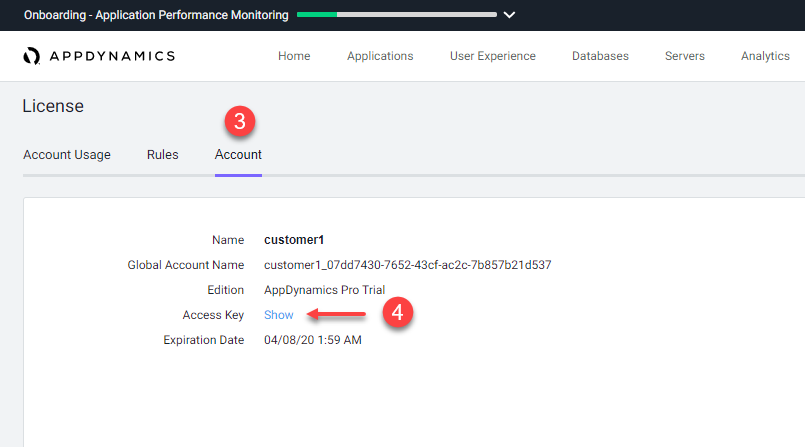
<br><br>

5. Now execute the command below in your SSH terminal window using your controller access key you obtained in the last step.

```bash
kubectl -n appdynamics create secret generic cluster-agent-secret --from-literal=controller-key='<your-controller-access-key>'
```


```bash
Example:

kubectl -n appdynamics create secret generic cluster-agent-secret --from-literal=controller-key='c00f6f2a-33bd-4704-b314-eb29662f4572'
```

You should see output from the command like the image below:
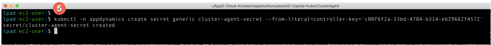
<br><br>

6. Now use the command below to change to the directory where you will edit the "cluster-agent.yaml" file.

```bash
cd ~/AppD-Cloud-Kickstart/applications/aws/AD-Capital-Kube/ClusterAgent
```
<br>

7. Now edit the "cluster-agent.yaml" file with the editor of your choice and replace the values in lines 7, 8, 9, and 11.

BEFORE:
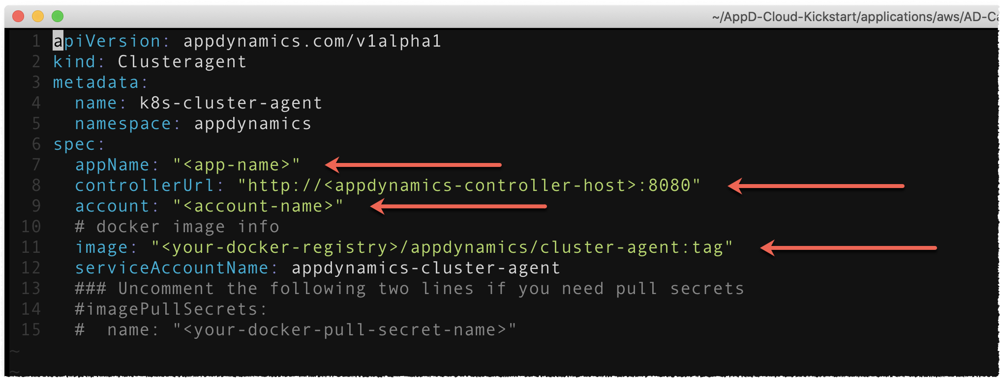

<br>

Line 7 should = "**AD-Capital**"<br>
Line 8 should = The URL for your controller including the protocol and port (with double quotes). Also, change `8080` to `8090`.<br>
Line 9 should = "**customer1**"<br>
Line 11 should = "**edbarberis/cluster-agent:latest**"

**Note:** Use the value seen above for Line 11 unless you built your own docker image in step number 2.  In that case you would use the Image URI of your own docker image (surrounded in double quotes).

<br>

AFTER EXAMPLE:
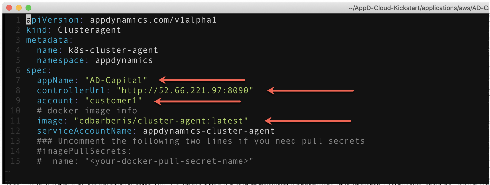
<br><br>

8. Now execute the commands below to deploy the Cluster Agent.  After executing the commands you should see the output like the image below.

```bash
cd ~/AppD-Cloud-Kickstart/applications/aws/AD-Capital-Kube/ClusterAgent

kubectl create -f cluster-agent.yaml
```
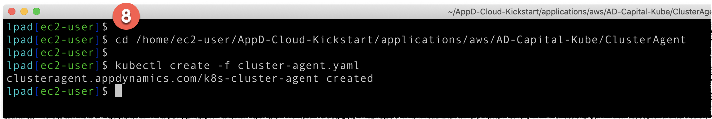
<br><br>

In the AppDynamics UI, validate that the Cluster Agent is now installed with the following steps.

9. Click on the gear icon in the top right of the controller UI
10. Select the "AppDynamics Agents" option from the dropdown menu

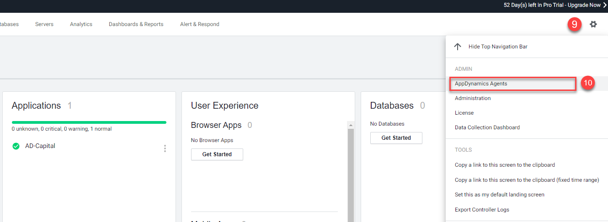
<br><br>

11. Click on the "Cluster Agents" tab and you should see the "AD-Capital" cluster agent like the image below.

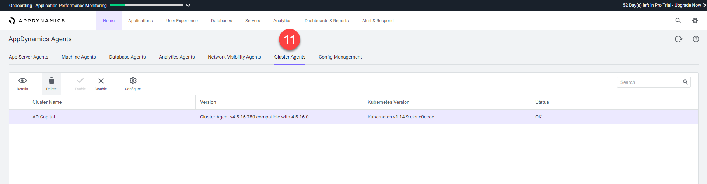
<br><br>

12. From here you can also click on the "Configure" button on the toolbar to add additional namespaces to be monitored by the Cluster Agent by moving them from the right list box to the left list box.

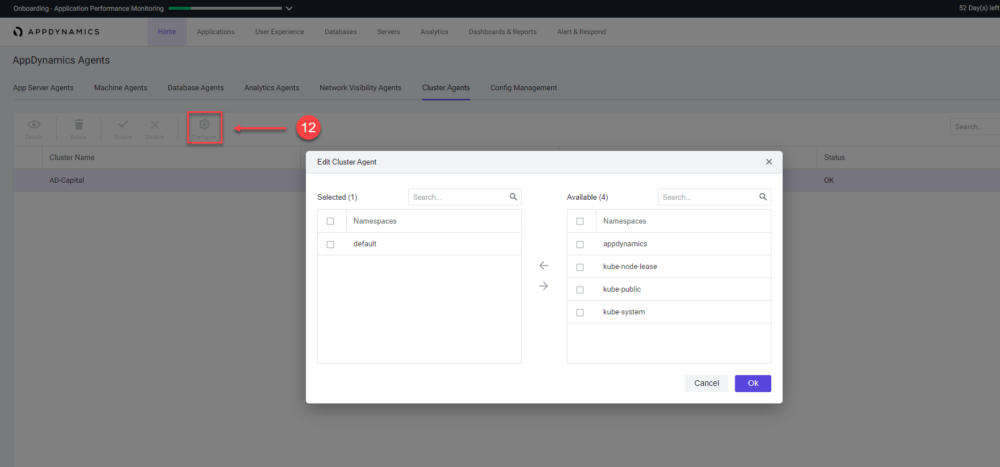
<br><br>

### **4.** Install the Kubernetes Metric Server

Use your web browser to naviate to the URL below:

```bash
https://docs.aws.amazon.com/eks/latest/userguide/metrics-server.html
```

Follow the instructions to install the Kubernetes Metric Server.  Execute the command(s) in the instructions in your SSH terminal window.

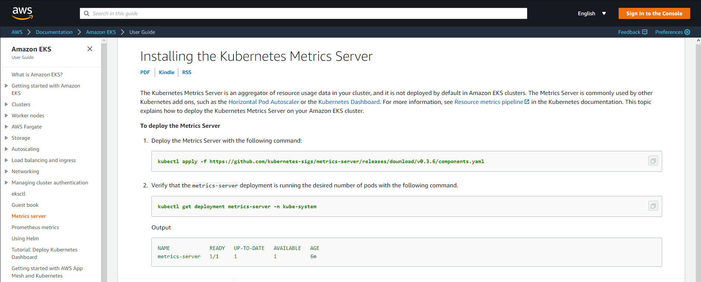
<br><br>

After executing the command in your SSH terminal window, you should see output like the image below.

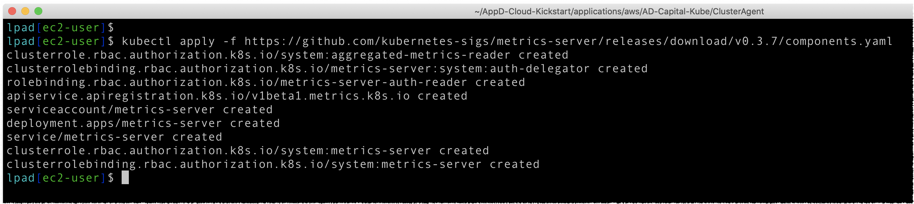
<br><br>

### **5.** Monitor the results of deploying the Cluster Agent

In the AppDynamics UI, monitor the results of deploying the Cluster Agent by navigating to the "Servers" tab, then click on the "Clusters" tab on the left, then double click on the "AD-Capital" cluster.

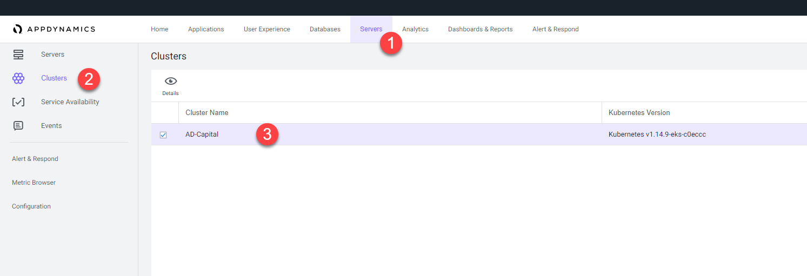
<br><br>

On the Cluster Dashboard Tab you can see a high level view of the state of all the pods in the cluster.  Explore the data found here on this screen and look at the corresponding documentation for this screen here:

```bash
https://docs.appdynamics.com/display/PRO45/Monitor+Cluster+Health#MonitorClusterHealth-DashboardTab
```
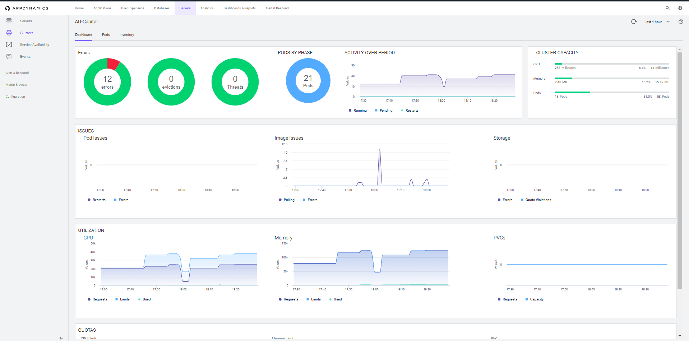
<br><br>

On the Pods Dashboard Tab you can see all the pods in various states and as well as a high-level summary of each pod.  Explore the data found here on this screen and look at the corresponding documentation for this screen here:

```bash
https://docs.appdynamics.com/display/PRO45/Monitor+Cluster+Health#MonitorClusterHealth-PodsTab
```
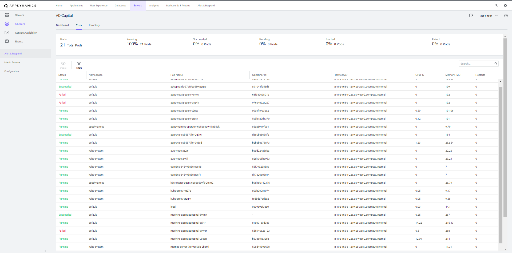
<br><br>

On the Pods Dashboard Details screen you can see all the details for a given pod as well as information about the containers running in the pod.  Explore the data found here on this screen and look at the corresponding documentation for this screen here:

```bash
https://docs.appdynamics.com/display/PRO45/Monitor+Cluster+Health#MonitorClusterHealth-PodDetailsScreen
```
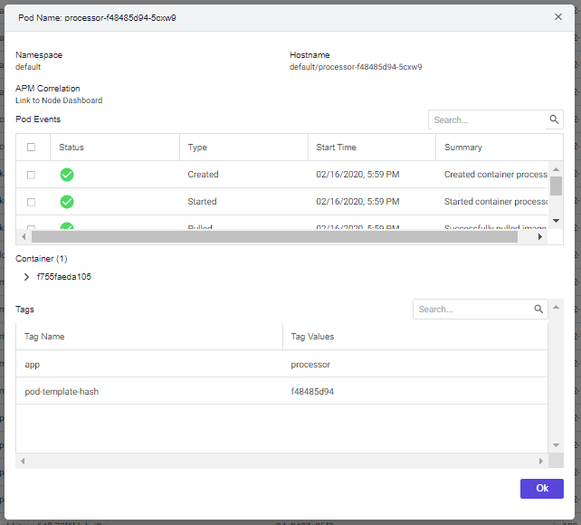
<br><br>


On the Inventory Dashboard Tab you can see a high-level snapshot or inventory view of your cluster. It displays the contents of the cluster and allows users to troubleshoot applications running in the cluster.  Explore the data found here on this screen and look at the corresponding documentation for this screen here:

```bash
https://docs.appdynamics.com/display/PRO45/Monitor+Cluster+Health#MonitorClusterHealth-InventoryTab
```
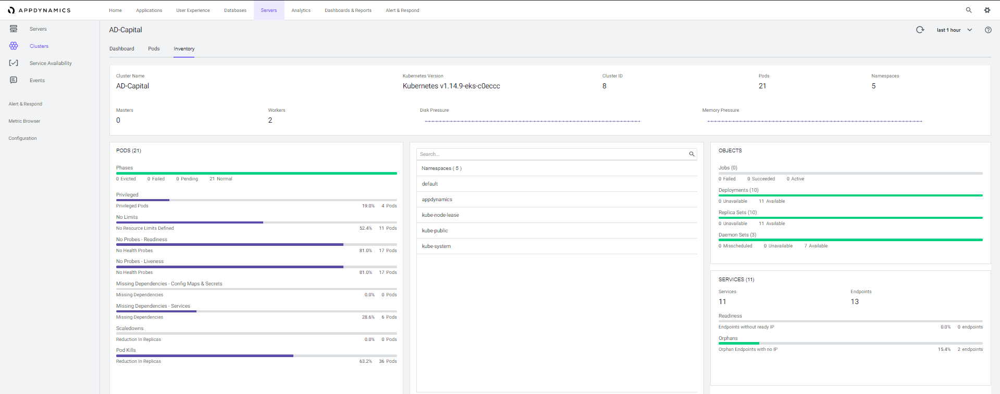
<br><br>

## Congratulations! You have finished the AWS EKS Monitoring Lab.
<br>

[Overview](gcp-gke-monitoring.md) | [1](lab-exercise-01.md), [2](lab-exercise-02.md), [3](lab-exercise-03.md), [4](lab-exercise-04.md), 5 | [Back](lab-exercise-04.md) | Next
