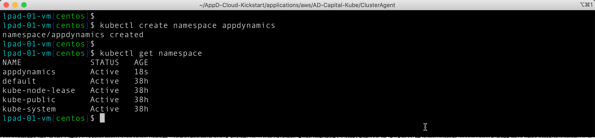
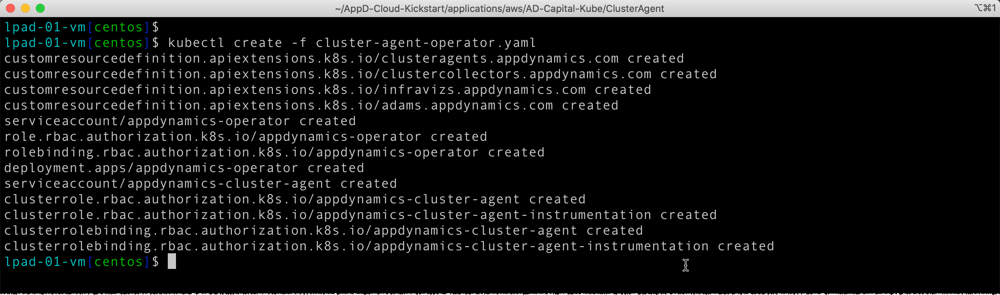
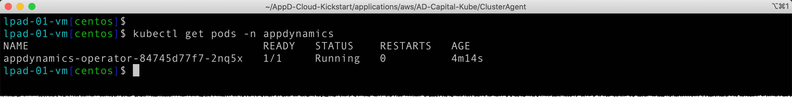
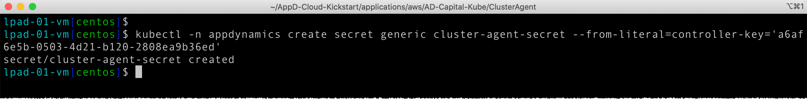
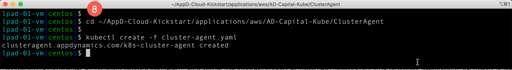
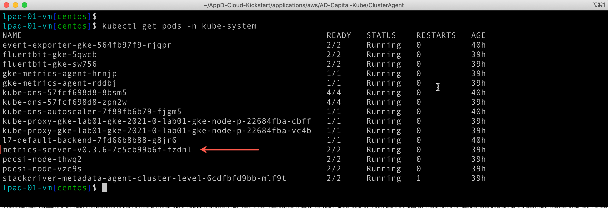

# Lab Exercise 5
## Deploy the Cluster Agent to GKE

In this exercise you will need to do the following:

- Deploy the Cluster Agent Operator to the GKE cluster
- Build the Cluster Agent Docker image
- Configure and Deploy the Cluster Agent
- Verify Kubernetes Metric Server Deployment
- Monitor the results of deploying the Cluster Agent

<br>

### **1.** Deploy the Cluster Agent Operator to the GKE cluster

Using the SSH terminal for the Launch Pad EC2 instance, change to the directory to unzip the Cluster 
Agent Zip file:

```bash
cd ~/AppD-Cloud-Kickstart/applications/aws/AD-Capital-Kube/ClusterAgent

ls -l
```

Now use the command below to unzip the Cluster Agent Zip file:

```bash
unzip appdynamics-cluster-agent-alpine-linux.zip
```

You should see output from the command similar to the image seen below:


<br>

Use the command below to create the namespace for the Cluster Agent Operator:

```bash
kubectl create namespace appdynamics
```

Use the next command below to verify the appdynamics namespace was created:

```bash
kubectl get namespace
```

You should see output from the command similar to the image seen below:



<br>

Use the command below to deploy the Cluster Agent Operator to the GKE cluster:

```bash
kubectl create -f cluster-agent-operator.yaml
```
You should see output from the command similar to the image seen below:



<br>

Use the next command below to verify the Cluster Agent Operator was deployed and is now running:

```bash
kubectl get pods -n appdynamics
```

You should see output from the command similar to the image seen below:



<br>

### **2.** Build the Cluster Agent Docker Image

If you were deploying the Cluster Agent in your own Kubernetes cluster, you would need to build your 
own Cluster Agent Docker image in a Docker repository such as the GCP Container Registry. Instructions 
for building your own Docker image in the GCP Container Registry can be found in the 
[Quickstart for Container Registry](https://cloud.google.com/container-registry/docs/quickstart) and 
the [Pushing and pulling images](https://cloud.google.com/container-registry/docs/pushing-and-pulling) 
documentation guides. They are included for reference only and you do not have to perform those steps in 
order to complete this lab. See also the [Container Registry](https://cloud.google.com/container-registry) 
product overview for more information.  

However, for the purposes of this lab, we will use a pre-built Cluster Agent Docker image with the following 
Image URI: 

```bash
edbarberis/cluster-agent:latest
```

<br>

### **3.** Configure and Deploy the Cluster Agent

In the AppDynamics UI, find and copy your controller access key using the following steps:

1. Click on the gear icon in the top right of the controller UI
2. Select the "License" option from the dropdown menu


<br>

3. Click on the "Account" tab
4. Then click on the "Show" link to the right of the Access Key to reveal the Access Key value, then highlight and copy your Access Key into a text file


<br>

5. Now execute the command below in your SSH terminal window using your controller access key you obtained in the last step.

```bash
kubectl -n appdynamics create secret generic cluster-agent-secret --from-literal=controller-key='<your-controller-access-key>'
```

Example:
```bash
kubectl -n appdynamics create secret generic cluster-agent-secret --from-literal=controller-key='a6af6e5b-0503-4d21-b120-2808ea9b36ed'
```

You should see output from the command like the image below:



<br>

6. Now use the command below to change to the directory where you will edit the "cluster-agent.yaml" file.

```bash
cd ~/AppD-Cloud-Kickstart/applications/aws/AD-Capital-Kube/ClusterAgent
```
<br>

7. Now edit the "cluster-agent.yaml" file with the editor of your choice and replace the values in lines 7, 8, 9, and 11.

BEFORE:


<br>

Line 7 should = "**AD-Capital**"<br>
Line 8 should = The URL for your controller including the protocol and port (with double quotes). Also, change `8080` to `8090`.<br>
Line 9 should = "**customer1**"<br>
Line 11 should = "**edbarberis/cluster-agent:latest**"

**Note:** Use the value seen above for Line 11 unless you built your own docker image in step number 2. In that case you would use the Image URI of your own docker image (surrounded in double quotes).

<br>

AFTER EXAMPLE:


<br>

8. Now execute the commands below to deploy the Cluster Agent. After executing the commands you should see the output like the image below.

```bash
cd ~/AppD-Cloud-Kickstart/applications/aws/AD-Capital-Kube/ClusterAgent

kubectl create -f cluster-agent.yaml
```



<br>

In the AppDynamics UI, validate that the Cluster Agent is now installed with the following steps.

9. Click on the gear icon in the top right of the controller UI
10. Select the "AppDynamics Agents" option from the dropdown menu


<br>

11. Click on the "Cluster Agents" tab and you should see the "AD-Capital" cluster agent like the image below.


<br>

12. From here you can also click on the "Configure" button on the toolbar to add additional namespaces to be monitored by the Cluster Agent by moving them from the right list box to the left list box.


<br>

### **4.** Verify Kubernetes Metric Server Deployment

The Kubernetes Metrics Server is an aggregator of resource usage data in your cluster, and it is deployed 
by default in Google GKE clusters. For more information, see 
[Kubernetes Metrics Server](https://github.com/kubernetes-sigs/metrics-server) on GitHub. The Metrics 
Server is commonly used by other Kubernetes add ons, such as the Kubernetes Dashboard.  

For more information, see 
[Resource metrics pipeline](https://kubernetes.io/docs/tasks/debug-application-cluster/resource-metrics-pipeline/) 
in the Kubernetes documentation.  

For the purposes of this lab, let's verify the Kubernetes Metrics Server deployment by running the following command:

```bash
kubectl get pods -n kube-system
```

You should see output from the command similar to the image seen below:



<br>

### **5.** Monitor the Results of Deploying the Cluster Agent

In the AppDynamics UI, monitor the results of deploying the Cluster Agent by navigating to the "Servers" 
tab, then click on the "Clusters" tab on the left, then double click on the "AD-Capital" cluster.


<br>

On the Cluster Dashboard Tab you can see a high level view of the state of all the pods in the cluster. 
Explore the data found here on this screen and look at the corresponding documentation for this screen 
here:

```bash
https://docs.appdynamics.com/display/PRO45/Monitor+Cluster+Health#MonitorClusterHealth-DashboardTab
```


<br>

On the Pods Dashboard Tab you can see all the pods in various states and as well as a high-level summary 
of each pod. Explore the data found here on this screen and look at the corresponding documentation for 
this screen here:

```bash
https://docs.appdynamics.com/display/PRO45/Monitor+Cluster+Health#MonitorClusterHealth-PodsTab
```


<br>

On the Pods Dashboard Details screen you can see all the details for a given pod as well as information 
about the containers running in the pod. Explore the data found here on this screen and look at the 
corresponding documentation for this screen here:

```bash
https://docs.appdynamics.com/display/PRO45/Monitor+Cluster+Health#MonitorClusterHealth-PodDetailsScreen
```


<br>

On the Inventory Dashboard Tab you can see a high-level snapshot or inventory view of your cluster. It 
displays the contents of the cluster and allows users to troubleshoot applications running in the cluster. 
Explore the data found here on this screen and look at the corresponding documentation for this screen 
here:

```bash
https://docs.appdynamics.com/display/PRO45/Monitor+Cluster+Health#MonitorClusterHealth-InventoryTab
```


<br>

## Congratulations! You have finished the GCP GKE Monitoring Lab.

<br>

[Overview](gcp-gke-monitoring.md) | [1](lab-exercise-01.md), [2](lab-exercise-02.md), [3](lab-exercise-03.md), [4](lab-exercise-04.md), 5 | [Back](lab-exercise-04.md) | Next
